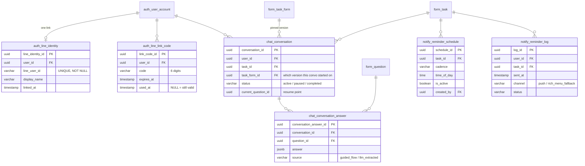

# ADR 0005: Data Model Changes & Migration Ownership

## Submitters

* _[Your name]_ (Is Thai Cacao Capstone Team)

## Change Log

* [approved](/docs/plans/architecture-session-notes#data-model) 2026-07-27

## Referenced Use Case(s)

* [EPIC 2 — LINE OA AI Chatbot](/docs/plans/architecture-session-notes#backlog-check) (conversation persistence, pause/resume)
* [EPIC 1 — Registration & LINE Auth](/docs/plans/architecture-session-notes#backlog-check)
* [EPIC 4 — Reminders & To-do](/docs/plans/architecture-session-notes#backlog-check)

## Context

The existing schema (`cocoa-database`, 8 schemas / 65 tables / 80 FKs) has no migration tool — schema changes today are hand-applied SQL, manually kept in sync across `schema.sql`, Kotlin's jOOQ codegen, and Go's GORM models (`GO-1`, split-brain data access). Adding ~10 new tables for the chatbot, identity linking, and reminders across two consumers (a new Python service plus the two existing backends) without a migration tool risks repeating the exact drift this review already found once (`DB-1`, a truncated `other.sql` that broke from-scratch rebuilds).

Separately: `form.task_form` (and its `section`/`question` children) has no versioning today. If a researcher edits a form while a chatbot conversation is paused mid-way ([US2-3]) or already answered against it, there's no way to tell which version an answer belongs to.

## Proposed Design

**Services/modules impacted:** `database` repo becomes the sole owner of the migration history; Go, Kotlin, and the new Python chatbot service all treat the DB as externally migrated rather than each applying their own SQL.

**New services/modules:** none — this is schema-only.

**Model/DTO impact:** new tables — `auth.line_identity`, `auth.line_link_code` ([ADR 0002](/docs/adr/line-identity-linking)); `chat.conversation`, `chat.conversation_answer` (new schema for chatbot state); `notify.reminder_schedule`, `notify.reminder_log` ([ADR 0006](/docs/adr/reminder-delivery)). Existing tables gain columns: `form.task_form` gets `version` + `is_active`; `form.response` gets `task_form_id` to pin the exact version answered against.

**API impact:** none directly — this is a data-layer decision consumed by the other ADRs' API work.

**Config/devops impact:** Flyway needs to land in the `database` repo's build/deploy pipeline before other schema work starts, per the team's own priority ordering this session.

## Considerations

**Migration tool — Flyway (chosen), matching `DB-6`'s existing recommendation.** Already the fix decided for the old system's own missing-migration-tool problem; adopting the same tool for new-work schema changes avoids running two migration mechanisms side by side.

**Migration ownership — `database` repo as sole owner (chosen) vs. each service managing its own migrations (rejected).** With three consumers now reading/writing overlapping tables (Go, Kotlin, the new Python service), independent migration histories would reintroduce the exact split-brain risk `GO-1` already names as the single biggest cross-repo architectural risk. One canonical history, applied once, referenced by all three.

**Form versioning — new row on edit (chosen) vs. mutate in place (rejected).** Mutating `form.section`/`form.question` in place is what the system does today, and is exactly what makes a paused chatbot conversation's slot references silently ambiguous. Creating a new `task_form` version on edit (matching the existing `section`/`question` `version`/`is_active` convention already in the schema) means old answers stay valid against the version they were actually answered under.

**How resolved:** decided directly with the team — Flyway adopted, `database` repo as sole owner, versioning added; full new-table shape logged below.

## Decision

Agreed implementation:
* **Flyway adopted**, `database` repo is the sole canonical migration owner.
* `form.task_form` gains `version` + `is_active`; editing a form with existing real responses creates a new version row rather than mutating in place. `form.response` gains `task_form_id`.
* `auth.line_identity.line_user_id` is `UNIQUE NOT NULL` from creation — the `DB-3` lesson (no uniqueness anywhere in the existing schema) applied to new tables on day one.
* Every new FK gets an index — the `DB-5` lesson (zero secondary indexes in the existing schema) applied on day one.
* `chat_conversation_answer.source` distinguishes guided-flow answers from LLM-extracted ones, so "researcher reviews AI-extracted fields" (US2-8) is checkable later without a schema change.
* `notify_reminder_log.channel` already has a slot for the rich-menu fallback, even though that fallback isn't committed backlog scope yet (see [Architecture Review recap, Part 3](/docs/plans/architecture-session-notes#backlog-check)).
* The LLM-extraction retry queue's table shape is deliberately left thin — diary extraction itself is deferred ([ADR 0004](/docs/adr/llm-extraction-approach)), so only its existence is noted, not its full column set.

Caveats: this data model also carries the fix for `form.response.task_log_id`'s missing FK ([ADR 0001](/docs/adr/old-new-integration-seam)) — tracked as `DB-2` in the existing register, now a hard dependency of the chatbot seam rather than a standalone weak point.

Deferred: the LLM-retry queue table's full column set, pending [ADR 0004](/docs/adr/llm-extraction-approach)'s own resolution.

## Other Related ADRs

* [ADR 0001 — Old↔New Integration Seam](/docs/adr/old-new-integration-seam) - depends on the `task_log_id` FK fix carried here
* [ADR 0002 — LINE Identity Linking](/docs/adr/line-identity-linking) - owns the `auth.line_identity` / `auth.line_link_code` requirement this ADR implements
* [ADR 0004 — LLM Extraction Approach](/docs/adr/llm-extraction-approach) - `chat_conversation_answer.source` supports its review requirement
* [ADR 0006 — Reminder Delivery](/docs/adr/reminder-delivery) - owns the `notify.*` table requirements implemented here

## References

* [Architecture Review recap — Part 4.5](/docs/plans/architecture-session-notes#data-model)
* [Flyway documentation](https://flywaydb.org/documentation/)
* [Critical Issues tracker — DB-2, DB-3, DB-5, DB-6](/docs/critical-issues)
* [Phase 0 Weak-Point Register — GO-1](/docs/phase-0)
