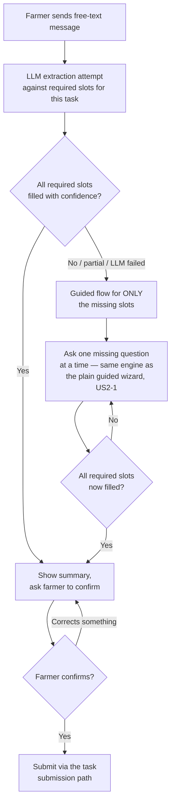
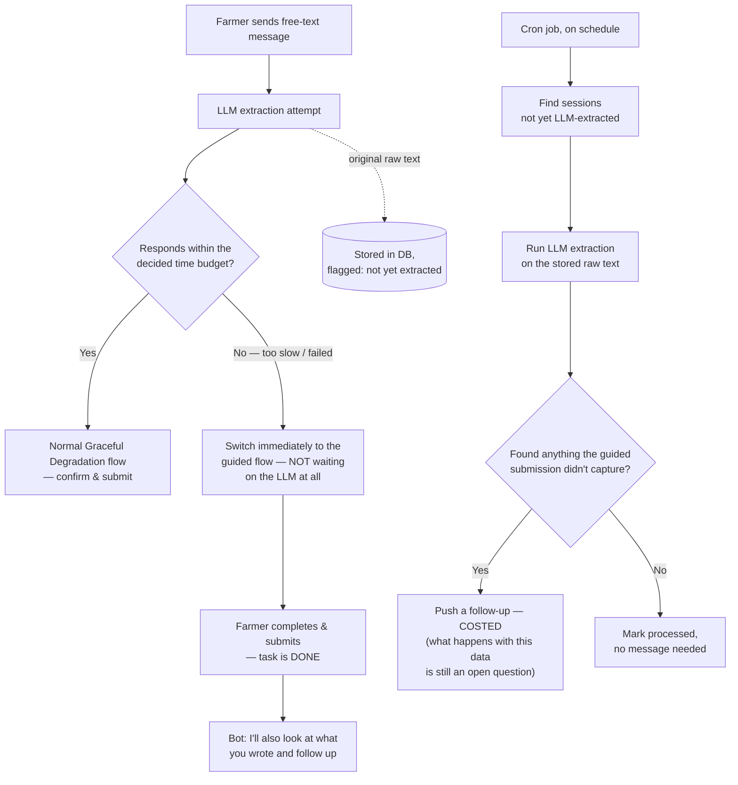
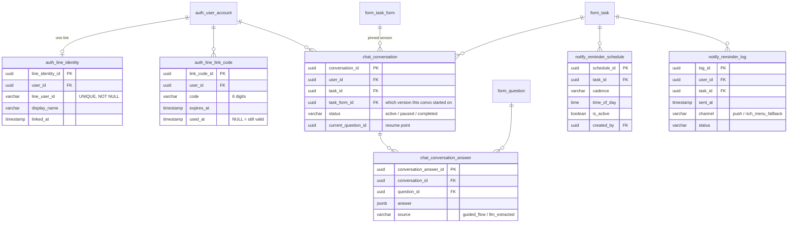

# Architecture Review — What We Found & Decided

This is the story of the architecture review for the LINE OA chatbot / app modernization / Knowledge Base / Computer Vision plan: what we found when we checked the inherited system against its own documentation, what that meant for the new work, and every decision made about how the new work gets built. Written to be walked through in a meeting, start to finish.

Every individual decision also has its own formal record in **[Architecture Decision Records](/docs/adr)** — this page is the narrative; the ADRs are the reference.

---

## Part 1 — What we found in the old system

Everything below was **verified directly against the code**, not assumed from the final report or old documentation. Several things the report describes turned out not to be true — flagged explicitly each time, because it matters for what the new plan can safely assume.

### The headline finding {#headline-finding}

> The "dynamic form engine" — the thing whose entire pitch was *"researchers push new questionnaires without touching code"* — is missing **both ends**. There's no path to create a new form (only edit an existing one), and even a successful edit never reaches the mobile app (which reads a bundled file, not the live database). This is the single most important thing the old system doesn't actually do.

### Database

- The schema went through **3 real evolution phases** — basic prototype → dynamic forms/wizard UI (driven by real elderly-farmer field testing in Chiang Mai) → "entity-centric + high-resolution tracking" (after Prachuap beta testing). It wasn't designed once; it responded to real usability findings twice.
- **2 claims from that last phase don't hold up against the live schema.** The final report says the DB was "re-engineered to track assets down to individual cacao trees" for future carbon-credit work — reality is one orphaned `tree_id` column, no `tree` table, always NULL. It also claims a move to "transactional snapshot logging" — there is no snapshot/history table anywhere in the schema. Both read as intent that never got built.
- **`section` = a phase of the conversation, `question` = one chat turn** is the key mental-model bridge for the chatbot — the data model already assumes "ask one thing at a time." We're just changing the screen to a chat bubble.
- **`GEODATA` questions** currently mean "open a map picker" on mobile — LINE's native location-message type is the direct chat equivalent (see the LINE OA primer below).
- **File/photo evidence has no home in the form engine** — no `FILE` input type exists in `form.question`; uploads live entirely outside this system (`storage.file`). Team's own lean: probably don't need it in the chatbot flow.

### Mobile pair (Go backend + Flutter app)

- **🔴 The dynamic form engine and the mobile app aren't actually connected.** The final report (§4.1.3) claims researchers can *"remotely dispatch targeted questionnaires... without changing core source code."* Checked the mobile code directly:
  - `lib/bloc/dynamic/dynamic.dart:68-69` and `:88-89` — both `LoadSchemaAndData` and `SubmitForm` read field definitions from **`assets/schema.json`, bundled into the app at build time** — not from the live `form.section`/`form.question` tables.
  - `assets/schema.json` has 59 entries, each mirroring a **destination table's own columns** (e.g. `definitions.harvest` looks like `collection.harvest`'s columns) — not the researcher-authored question list.
  - No other code path in the Flutter app consumes `form.section`/`form.question` — confirmed by grepping the whole codebase. `lib/services/task_service.dart:9,30` shows `GET /tasks/:taskId` only returns the raw previously-saved answer.
  - **Net effect:** a researcher editing a question via the web app has zero effect on the phone until a dev manually updates `schema.json` and ships a new build — the opposite of what's documented.

- **🔴 The `handler` dissection mechanism doesn't appear to be implemented at all.** Originally described (from the team's own sequence-diagram documentation) as "10 hand-written functions that insert real rows into the domain tables." The actual code in `internal/handlers/form_handler.go:64-112` (`SubmitTask`) is:
  ```go
  switch taskForm.Handler {
  case "harvest":
      fmt.Println("ประมวลผล: harvest")
  // ... case อื่นๆ ...
  default:
      fmt.Printf("บันทึกทั่วไปสำหรับ handler: %s\n", taskForm.Handler)
  }
  ```
  That's a log line, not an insert. No `INSERT`/`Create` into any of the 10 domain tables exists anywhere in the Go codebase — every other reference to `collection.harvest`/`processing.batch` is a read, never a write. Checked the full route table too — there's no `POST /harvests`, `POST /batches`; `POST /tasks` is the only write path, and its dissection is a stub. **Status: unconfirmed whether this is genuinely unfinished or the real logic lives elsewhere** — but taken at face value, submitting a harvest/batch form today doesn't create the record it's supposed to.

- **Auth has no roles in the token.** `auth_handler.go:92` has a comment stating the actual intent — *"send userID AND roles too, so Middleware can check permission"* — directly above where `GenerateToken(user.UserID, user.Username)` is called with no roles parameter. Roles are fetched (`:70-86`) and returned once in the login response, but never embedded in the JWT. `auth_middleware.go:36-38,46` confirms only `user_id` is ever read back out.

- **No service layer, structurally.** `internal/` contains only `database/`, `handlers/`, `middleware/`, `models/` — no `services/`. `RegisterFarm` (`agriculture_handler.go:162` onward) mixes HTTP parsing, the DB transaction, business rules, and the response all in one function.

### Web pair (Kotlin backend + Next.js app)

- **The one-liner worth keeping:** *"Go never built the lock, Kotlin built the lock and just forgot to put it on a couple of doors."* Go has no roles in its token at all. Kotlin has a real, working fine-grained permission system (`@PreAuthorize("hasAuthority('read:form:all')")`, confirmed used — 10 instances in `AnalyticsController` alone) — it's just missing on `FormResponseController`/`TaskController`/the bulk export endpoint.
- **🔴 No way to create a new form — only edit one.** `FormController` has exactly 3 endpoints: `GET /forms`, `GET /forms/{formId}`, `PUT /forms/{formId}/edit`. No `POST` anywhere for forms/tasks/sections/questions in the whole backend. Same gap on the Next.js side (`form-edit`/`form-viewer` routes exist, no `form-create`). `editForm` (`FormService.kt`) requires the form to already exist (`FormRepository.findByFormId(formId) ?: throw ...`). This explains where the 82 real `task_form` rows in seed data came from — direct SQL, never the app.
- **White-label/multi-flavor support doesn't exist.** A claim repeated earlier this review (from a teammate's AI-generated analysis doc, never independently verified) that the app supports "100+ cooperative flavors" via config — searched the entire Flutter codebase for `flavor`/`cooperative`/`whitelabel`/`tenant`/`brand`, zero matches, no custom config files. Aspirational, not built.

---

## Part 2 — What this means for the new project, by repo

Not "here's what's broken" — "here's what you can't assume when designing the new plan."

**`database`**
- No migration tool, about to add ~10 new tables across two repos — Flyway needs to land *before* schema work starts.
- No form versioning — pause/resume chatbot conversations (US2-3) can silently break if a form is edited mid-conversation.
- `form.response.task_log_id` has no FK — chatbot becomes a second writer into an already-weak link.
- No UNIQUE constraints anywhere, zero indexes — new tables need their own discipline from day one, nothing safe to inherit.
- Tree-tracking/snapshot-logging claimed but never built — greenfield if ever needed.
- *Also tracked in the Phase 0 register:* `DB-1`, `DB-7`, `DB-8`, `DB-9`.

**`mobile-backend` (Go)**
- Handler dissection is a stub — directly breaks the original assumption that the chatbot gets dissection "for free."
- No roles in the JWT — SSO can't be built cleanly on a bare user ID.
- No service layer — nothing reusable if the chatbot wants tighter integration later.
- No tests, and this repo gets touched by three efforts at once this year.
- *Also tracked:* `GO-2`, `GO-3`, `GO-6`, `GO-7`.

**`mobile-app` (Flutter)**
- Forms render from a bundled file, not the live DB — this app can't reflect a new/edited form without a rebuild, independent of the chatbot.
- Hardcoded LAN IP, plain HTTP — blocks normal multi-environment dev.
- White-label doesn't exist despite being described as a feature.
- Session data in plaintext, combined with plain HTTP.
- *Also tracked:* `APP-3`, `APP-5`.

**`web-backend` (Kotlin)**
- No form-creation endpoint — the other half of "missing both ends."
- No `@PreAuthorize` on task-response/export endpoints — any researcher can already read anyone else's data.
- Auth cookie not marked Secure.
- *Also tracked:* `BE-4`/`BE-5`, `BE-9`, `BE-10`.

**`web-app` (Next.js)**
- Self-registration broken end-to-end (frontend unwired, backend a no-op).
- A real bug misclassifies every 5xx response (`in` operator on an array).
- Admin user-management endpoint is a dead stub.
- *Also tracked:* `FE-3`/`FE-4`, `FE-8`.

**The one that cuts across three repos:** "the dynamic form engine is missing both ends" isn't a single-repo problem — no creation path (`web-backend`), no live rendering path (`mobile-app`), no versioning safety net (`database`). Every EPIC 2 story assumes forms are genuinely dynamic. Closer to a Phase I prerequisite than a nice-to-have.

---

## Part 3 — Checking the new plan against its own backlog {#backlog-check}

Read the full Product Backlog workbook — `Roadmap (Business/Engineering)`, `Sprint Plan (Business/Engineering)`, the complete `Product Backlog` (all 7 EPICs), `Image Processing Plan`, `Team & Allocation`.

**Shape:** 212 total points (Phase I: 128, Phase II: 84). Handover **Dec 20, 2026**. Phase II runs strictly sequential after Phase I — never in parallel — so a Phase I overrun shrinks Phase II, never the reverse.

**7 EPICs:** Registration & LINE Auth · LINE OA AI Chatbot (conversational forms, autofill, pause/resume, diary extraction, researcher review) · SSO · Reminders & To-do · Submission History (web-only) · Knowledge Base [Phase II] · Computer Vision [Phase II, gated G1→G2→G3].

**Success metrics on record:** ≥70% of active farmers using the chatbot by handover; ≥40% of submissions using autofill/free-text with ≥90% end-to-end success; KB views per active farmer; CV must clear an accuracy bar per gate.

**The risk register already independently named several things this review found on its own** — a good sign: LLM cost/latency → *"cap usage, cache, allow manual fallback; treat as enhancement not hard dependency"* (matches the Graceful Degradation design almost exactly); chatbot epic oversized → explicit descope order (diary NLP first to cut); academic calendar → buffer sprints already planned.

**🔴 The one flagged hardest:** `Roadmap (Engineering)`'s own dependency notes state *"Chatbot form schema — reads the existing (unchanged) legacy form schema... no new researcher form-builder needed."* This assumption rests directly on the exact gap found above — no creation path exists, and the mobile app doesn't even read the live schema. This needed an explicit decision (see Part 4).

**Confirmed directly with the team:**
- The rich-menu-to-do fallback for reminders exists only as a risk-mitigation sentence, not committed backlog scope — **needs a real task under EPIC 4.**
- Sprint-numbered detail tabs are execution-scheduling only — `Product Backlog` + `Sprint Plan` are the authoritative feature source.
- The `Sprint 1 (Detail)` date mismatch and exactly how adoption metrics get measured — both explicitly out of scope for this review.

---

## Part 4 — The architecture decisions

Full formal record of each lives in the [ADR folder](/docs/adr); this is the narrative version.

### 1. The old↔new seam — where the chatbot actually plugs in {#seam}

**Contact points, named precisely:** `form.task`, `form.task_form.handler`, `form.section`, `form.question`, `form.response`, `auth.user_account`/`auth.user_role`, `ref.*_constant` at the database level; `form_handler.go: SubmitTask()` and the auth files on the Go side; Kotlin's `FormController.getForm → FormService.getFormDetail → FormRepository.fetchForm/buildSections/fetchRefChoices` (`GET /forms/{formId}`) — the one place in the system that already correctly assembles a form with resolved choices. **Not** a contact point: `mobile-app` (sibling client of Go) and `web-app` (touched only as an SSO destination).

**Decided: reuse Kotlin's `GET /forms/{formId}` for reads, Go's `POST /tasks` for writes** — not a fresh parallel build in Go. Consequence: Kotlin's auth model now needs to accept chatbot-originated calls on a farmer's behalf, not just researcher logins.

**Definitely must change:** `SubmitTask()`'s dissection implemented for real (new finding, no register ID); `form.response.task_log_id`'s FK (`DB-2`); Go's JWT roles (`GO-2`); a new farmer-identity mapping table (net-new).

**Nice to change while this code is open:** Go service layer (`GO-7`); Go's cookie security (new finding); Kotlin's `fetchRefChoices` perf (`BE-5` — bumped in priority now that Option A is chosen, since chatbot conversation starts will call it far more often than the web app ever did); Go pagination (`GO-6`).

### 2. Identity & LINE — linking existing accounts, registering new ones {#identity-line}

**Rejected: in-app "Connect LINE" OAuth flow.** Real Flutter SDK/screen work added to an app already carrying the modernization refactor, for a flow that only reaches people with the app already open — and a worse fit for the project's own UX findings (unfamiliar OAuth screens vs. the low-digital-literacy persona from Chiang Mai testing).

**Rejected: "Login with LINE" as a separate flow.** Same underlying problem as above (how do you know which existing account a first-time LINE login belongs to?) — relocates the problem, doesn't solve it.

**Chosen: a verification/pairing code, no deep link.** App displays a short-lived code, farmer sends it as a plain LINE message, chatbot verifies and links. Smaller Flutter footprint, better match for the established user demographic. A real, named pattern (Discord phone-linking, smart-TV pairing, plenty of Thai banking apps already use it).

**New user registration:** entirely in LINE, reusing Go's existing `RegisterFarmerProfile`/`Register` logic rather than a parallel account system — the chatbot is a new front door, not a new house. `password_hash` stays NULL for LINE-only accounts.

**Checked and confirmed absent: SMS OTP.** The report describes it (§4.1.4); `Register()` (`auth_handler.go:111`) has zero verification logic. Another described-but-never-built gap — the linking code is net-new work, not reused infrastructure.

**Revises an earlier fix recommendation:** `DB-3`'s original suggested fix ("make `password_hash` NOT NULL") is now **wrong as written** — LINE-only accounts legitimately have no password. Correct fix: nullable stays, but enforce "password OR linked LINE identity" via `CHECK`/application invariant.

### 3. Chatbot service — the tech stack {#chatbot-stack}

- **Python, own service, own repo**, deployed stateless alongside the existing backends (hosting target since invalidated — see Part 5).
- **FastAPI over Flask** — async-native (matches the webhook ack-then-process pattern natively), and its bundled Pydantic serves double duty: validating data before it reaches Go's `SubmitTask`, and defining the LLM's structured-output schema.
- **`line-bot-sdk-python`** (official SDK) — webhook signature verification and LIFF identity handling in one dependency.
- **LIFF frontend: a separate, lightweight Vite+React app**, not folded into the existing Next.js `web-app` — LIFF is a handful of screens with no SSR/routing need; reusing Next.js would be more machinery than the surface warrants.
- **Async — two distinct tools, not conflated:** FastAPI's built-in `BackgroundTasks` for "ack fast, then process," and **APScheduler (not Celery+Redis)** for genuinely scheduled work — the LLM retry queue and reminder pushes. No separate broker to run for a 4-person team at this volume.

### 4. LLM extraction {#llm-extraction}

- **Hosted API**, no self-hosting (no GPU budget).
- **LiteLLM** for provider abstraction — a unified interface across 100+ providers; switching models is a config string, not a rewrite. Structured/JSON-mode output supported across providers. **Rejected LangChain** — more machinery (chains, agents, memory) than "call an LLM against a schema" needs.
- **PII boundary:** send only the free-text needed for extraction, never full farmer PII.
- **Diary extraction itself (US2-6/7/8) is deferred to the team**, pending real Thai-language test data — provider quality on Thai agronomy text can't be judged from a spec sheet. Not blocking; the guided flow (US2-1) works standalone.

**Design principle produced along the way — Graceful LLM-to-Flow Degradation:** the LLM path is the first pass of the same slot-filling engine already used for guided form-filling, not a separate thing to build and maintain.

- Farmer sends free text → system sends it to the LLM with the required-fields schema (the same slots already defined by `question.is_mandatory`)
- Filled slots → straight to confirmation summary. Unfilled slots (including total LLM failure) → guided flow for just those, one at a time, same engine as the plain wizard
- Confirm before commit, always



**Refined further:** past a time budget (exact threshold TBD), the farmer switches immediately to the guided flow — never blocked waiting on a retry. The original message is preserved, flagged "not yet extracted"; a cron job finds and retries these in batch later. Any follow-up this produces is necessarily a **paid push** (past the ~1-minute reply-token window, verified from LINE's own docs). Open question, not yet decided: what happens with something the late extraction finds — auto-create a record, flag for researcher review, or stay informational.



### 5. Data model {#data-model}

**Flyway adopted, owned by the `database` repo** — the one canonical migration history; Go, Kotlin, and the Python service all treat the DB as migrated externally.

**Form versioning:** `form.task_form` gets `version` + `is_active` (matching the existing `section`/`question` convention); editing a form with real responses creates a new row rather than mutating in place. `form.response` gets `task_form_id` to pin exactly which version was answered against.



**Deliberate choices:** `auth_line_identity.line_user_id` is `UNIQUE, NOT NULL` from the start (the `DB-3` lesson applied on day one). `notify_reminder_log.channel` already has a slot for the rich-menu fallback once it becomes real scope. `chat_conversation_answer.source` makes "researcher reviews AI-extracted fields" (US2-8) checkable later without a redesign. Every FK gets an index (the `DB-5` lesson). The LLM-extraction queue table is deliberately left thin — diary extraction is deferred, so only its shape is noted.

### 6. Reminders {#reminders}

Nothing new beyond what's already covered above. One operational rule: the periodic reminder check must be **idempotent against `notify_reminder_log` itself**, not against APScheduler's in-memory state, which doesn't survive a restart.

### 7. Deploy/ops — see Part 5, this one has an open blocker {#deploy-ops}

CI/CD: **GitHub Actions**, confirmed already in use — the new repo(s) mirror the same pipeline pattern (lint → type-check → test → build → deploy). Feature flags: env-var, per-service, no shared mechanism. **Hosting is unresolved — see below.**

### 8. Knowledge Base — mostly parked for Phase II {#knowledge-base}

Only two things ratified now: search approach (keyword/category for MVP, vector/RAG deferred) and that authoring lives inside the existing Next.js app. A read-path simplification was floated (chatbot reads `kb.*` directly, no Kotlin proxy needed, since KB has one writer and many readers) — correctly pushed back on as premature; parked for Phase II's own design pass around Sprint 11.

### 9. Computer Vision — Phase II, gated, barely touched on purpose {#computer-vision}

Tech direction only: PyTorch (transfer learning off a pretrained model), an inference API matching the chatbot service's own FastAPI stack, lightweight dataset/annotation tooling. Everything else depends on data that doesn't exist yet — matches the G1→G2→G3 gate structure already in the plan.

---

## Part 5 — Open items and next steps {#open-items}

**Genuinely still open:**

- **🔴 Hosting for the whole system.** There is no AWS account being handed over from the old team — this invalidates the assumption behind the chatbot service's deploy target ("the existing 3-VM setup"). The database is unaffected (independently on the team's own NeonDB account already), but where the Go backend, Kotlin backend, and the new chatbot service actually run is a real open question — possibly affecting the *existing* backends' hosting too, not just the new service. **Pending — being raised with the team and the old team directly. This is the one thing blocking real Deploy/ops work.**
- **Knowledge Base's read-path** — parked for Phase II, ~Sprint 11.
- **Diary extraction itself** — deferred to the team pending real test data.

**Action items for the team, outside architecture work:**
- Add a real task/story for the rich-menu-to-do reminder fallback under EPIC 4.
- Get the AWS/hosting answer.
- Run the diary-extraction spike once test data exists.
- Whoever implements `DB-3`: apply the revised fix (nullable `password_hash` stays; enforce "password OR linked LINE identity" instead of blanket `NOT NULL`).

**Formal decision records:** every ratified decision above has its own ADR in **[/docs/adr](/docs/adr)** — context, options considered, the decision, and consequences, in the standard template format.
