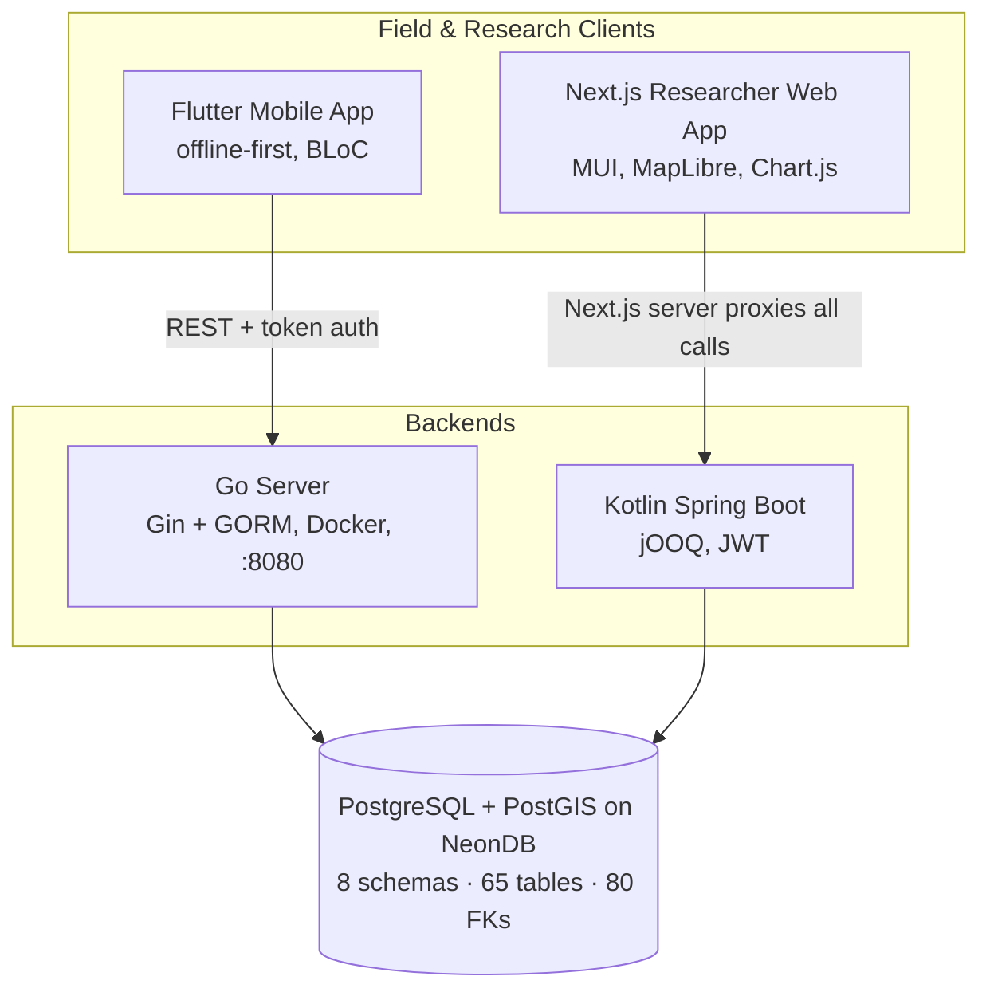
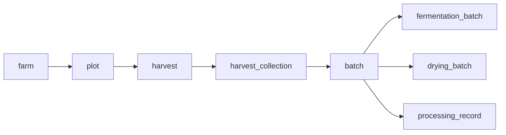

# Architecture Overview

## Components

Key structural facts:

- **Two backends, one database.** The Go server serves the mobile app; the Kotlin server serves the researcher web app. They share the PostgreSQL database — the schema is the integration contract. Any schema change affects both backends (and requires a jOOQ regen on the Kotlin side).
- **The web app never calls the backend from the browser.** All requests go through the Next.js server, which holds the credentials. This was a deliberate decision to keep environment variables out of the client build and make Docker images environment-agnostic.
- **The mobile app is offline-first.** Form submissions queue locally (`pending`) and sync in the background; conflicts resolve by timestamp + UUID.
- **Dynamic forms are the core mechanism.** Researchers define tasks/forms (`form` schema: task → task_form → section → question); the Go server serves the schema to mobile, then dissects submitted payloads into domain tables rather than storing blobs.

## Data model — traceability chain

The database's backbone is the FK-enforced chain from farm to processed batch:

The 8 database schemas map one-to-one to business domains:

| Schema | Domain |
|---|---|
| `auth` | Users, roles, permissions (RBAC) |
| `ref` | Lookup data (provinces, breeds, grades, …) — *also contains trigger-maintained mirror tables, see [D5b](/docs/database/fix-decisions#d5b)* |
| `agriculture` | Farmers, farms, plots, activities |
| `collection` | Harvests and collection into batches |
| `processing` | Hubs, stations, batches, fermentation, drying |
| `storage` | Geometry (PostGIS) and generic file store |
| `form` | Dynamic form engine (tasks, questions, responses) |
| `research` | Research tasks and assignments |

Full ER diagrams and findings: [Database Review](/docs/database/db-review).

## Reference diagrams

Handed-over SVGs, viewable on the [Diagrams page](/docs/architecture/diagrams):

- **System architecture** (v1 and v2)
- **Entity hierarchy**
- **Data submission sequence**
- **DB fix roadmap**

## Tech stack summary

| Layer | Tech | Notes |
|---|---|---|
| Database | PostgreSQL (NeonDB) + PostGIS + pgcrypto | UUID PKs everywhere; no migration tool yet ([O1](/docs/critical-issues#o1)) |
| Web backend | Kotlin, Spring Boot, jOOQ, JWT | No ORM — explicit SQL via jOOQ codegen |
| Mobile backend | Go, Gin, GORM, Docker Compose, port 8080 | Handlers / middleware / models; JWT cookie auth ([walkthrough](/docs/phase-0/go-server-walkthrough)) |
| Web frontend | Next.js 16, React 19, MUI 7, MapLibre, Chart.js | pnpm, Playwright tests |
| Mobile | Flutter 3.9+, BLoC, MapLibre GL | Offline-first, Material 3, Thai font |
