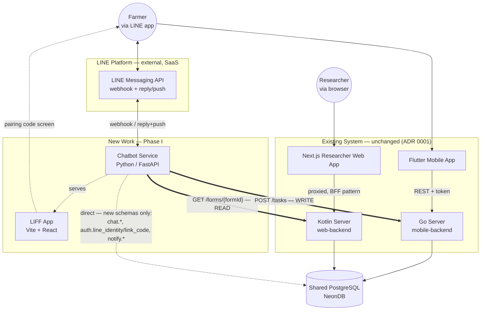
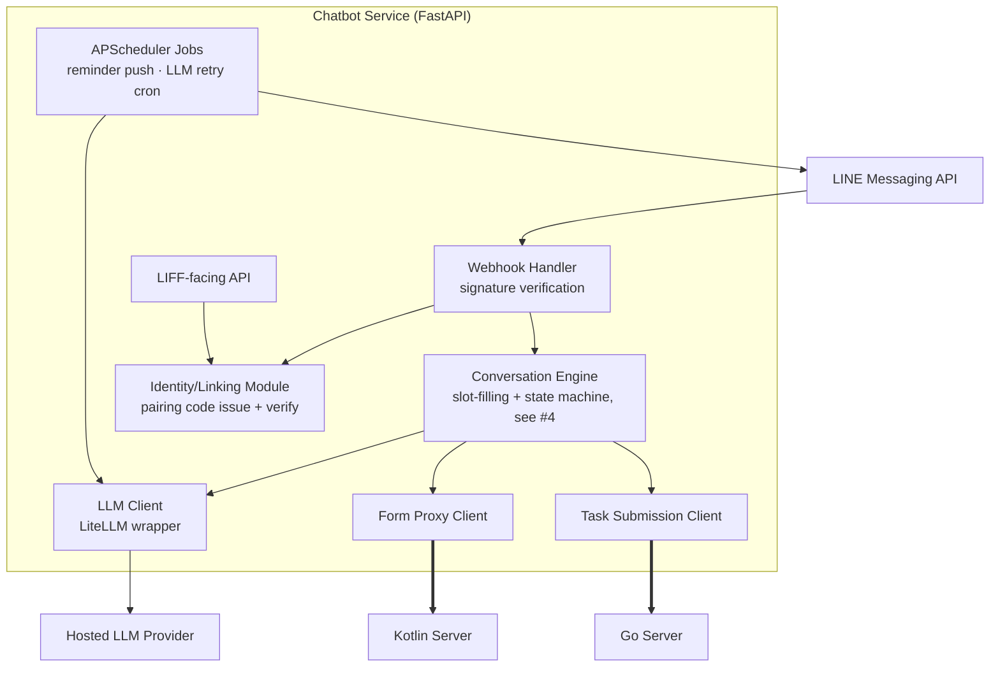
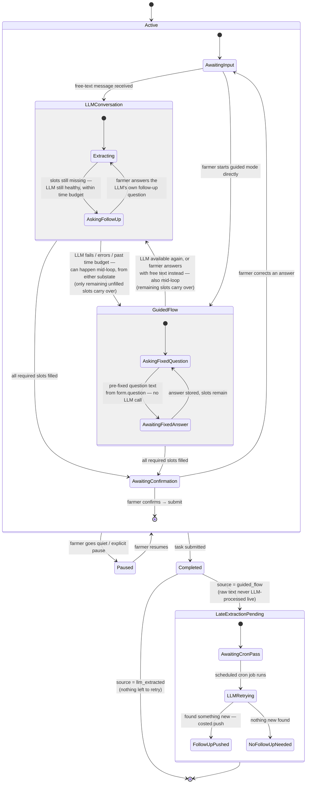
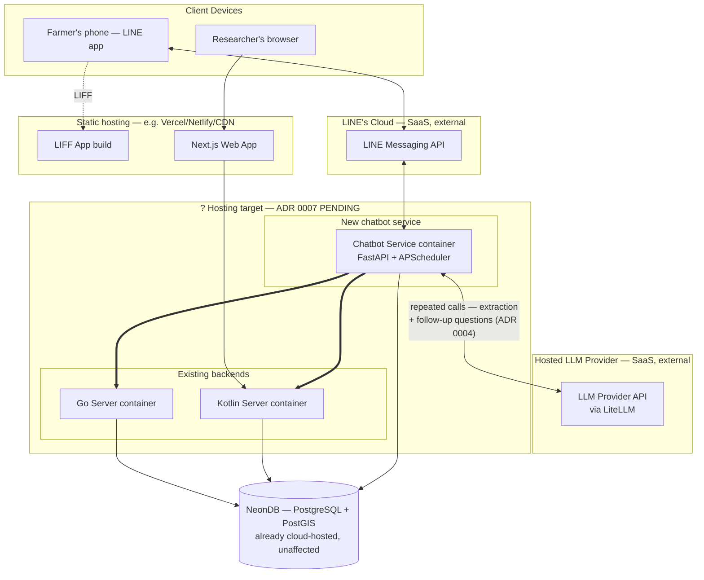

# Target Architecture — New Work

Five diagrams for the new work (LINE OA chatbot, identity linking, reminders), grounded in the ratified **[ADRs](/docs/adr)** and the **[Architecture Review recap](/docs/plans/architecture-session-notes)**. Where [Architecture Overview](/docs/architecture/overview) shows the *existing* system, this page shows the *target* — the old system stays as-is; these diagrams are additive.

Roughly the [C4 model](https://c4model.com/) (Context → Container → Component) plus two standard UML views it doesn't cover (sequence, state machine).

## 1. Context/Container — where the new work touches the old {#context}

The centerpiece: every system as a box, every real connection as a line. The thick arrows are the seam from **[ADR 0001](/docs/adr/old-new-integration-seam)** — the only two calls the new service makes into the old backends.

:::note[One inference worth double-checking]
The dashed Chatbot→DB line (new schemas only) isn't a separately-ratified decision — it follows from how **[ADR 0005](/docs/adr/data-model-changes)** already describes three consumers ("Go, Kotlin, and the new Python chatbot service all treat the DB as externally migrated"). The reasoning: `chat.*`, `auth.line_identity`/`link_code`, and `notify.*` are entirely new tables with no existing Go/Kotlin logic to duplicate, so the chatbot owning them directly doesn't reintroduce the split-brain problem (`GO-1`) that made reuse the right call for the *existing* form pipeline. Flag it if you intended something else — e.g. routing identity-linking writes through a new Go/Kotlin endpoint instead.
:::

## 2. Component — inside the chatbot service {#component}

Zooms into the single "Chatbot Service" box from #1.

Grounded in **[ADR 0003](/docs/adr/chatbot-service-stack)** (stack), **[ADR 0004](/docs/adr/llm-extraction-approach)** (LLM Client + retry job), **[ADR 0002](/docs/adr/line-identity-linking)** (Identity/Linking Module), **[ADR 0006](/docs/adr/reminder-delivery)** (reminder job).

## 3. Sequence — one real submission, end to end {#sequence}

Same seam as #1, as a call sequence instead of a static picture — matches the corrected mechanism in **[ADR 0004](/docs/adr/llm-extraction-approach)** (amended) and the [state machine](#state-machine): "still missing slots" and "LLM actually failed" are different triggers, not the same branch.

```mermaid
sequenceDiagram
    actor Farmer
    participant LINE as LINE Platform
    participant Bot as Chatbot Service
    participant LLM as LLM Provider
    participant Kotlin as Kotlin Server
    participant Go as Go Server
    participant DB as Shared DB

    Farmer->>LINE: Free-text message
    LINE->>Bot: webhook event (reply token, ~60s)
    Bot->>DB: look up auth.line_identity
    Bot->>Kotlin: GET /forms/{formId} (first turn only)
    Kotlin-->>Bot: form structure + resolved choices
    Bot->>LLM: extract required slots from free text

    loop while slots remain AND LLM healthy, within time budget
        LLM-->>Bot: partial slots + a follow-up question<br/>authored by the LLM
        Bot->>LINE: reply — LLM's own follow-up question
        Farmer->>LINE: answers
        LINE->>Bot: webhook event
        Bot->>LLM: extract again, with the new answer added
    end

    alt all required slots filled
        LLM-->>Bot: filled slots
        Bot->>LINE: reply — confirmation summary (within reply token)
        Farmer->>LINE: confirms
        LINE->>Bot: webhook event
        Bot->>Go: POST /tasks (submit)
        Go->>DB: dissect into domain tables
        Bot->>DB: write chat_conversation_answer (source=llm_extracted)
    else LLM fails / errors / past time budget
        Note over Bot,Farmer: switch to guided flow — only the slots<br/>still unfilled, static pre-fixed text, no more LLM calls
        Bot->>LINE: reply — pre-fixed question, one missing slot
        Note over Bot,Farmer: repeats one at a time — can switch back to<br/>the LLM path too if it recovers, see state machine #4
        Bot->>Go: POST /tasks (submit, once complete)
        Go->>DB: dissect into domain tables
        Bot->>DB: write chat_conversation_answer (source=guided_flow)
    end
```

:::note[Scope of this diagram vs. the state machine]
This sequence shows one representative path through the mechanism, including the "LLM stays healthy, asks its own follow-ups" loop that was missing before. It doesn't attempt to diagram the full bidirectional switching (guided flow back to the LLM path mid-loop) — sequence diagrams read poorly once branching gets that non-linear. The **[state machine (#4)](#state-machine)** is the authoritative, exhaustive model of every transition; this diagram is illustrative.
:::

## 4. State machine — a conversation's lifecycle {#state-machine}

The subject is `chat_conversation.status` (**[ADR 0005](/docs/adr/data-model-changes)**) — but that column alone (`active`/`paused`/`completed`) is too coarse to show the Graceful Degradation logic (**[ADR 0004](/docs/adr/llm-extraction-approach)**), so it's modeled as a **nested/composite state machine** with two distinct sub-machines inside `Active`, not one: `LLMConversation` (repeats *while the LLM is healthy* — it asks its own follow-up questions to collect what's missing) and `GuidedFlow` (the true fallback, entered only on real LLM failure, asking one-by-one with static pre-fixed text and no further LLM calls). The decoupled cron fallback is included too, as a strictly downstream branch off `Completed`, never looping back into `Active`/`Paused`.

:::note[Two loops, not one — this was the actual bug in the first two drafts]
Both earlier drafts collapsed two genuinely different loops into a single `GuidedFlow` state. There are really two:

* **`LLMConversation` — while the LLM is working.** The business logic isn't "one free-text message, one extraction attempt, done-or-fallback." If slots are still missing after an extraction pass but the LLM itself is healthy and within the time budget, the system stays in this loop: the LLM composes its *own* natural follow-up question, asks it, takes the farmer's answer, and extracts again. **"Slots still missing" alone never triggers a fallback** — only genuine LLM failure/error/timeout does.
* **`GuidedFlow` — the real fallback, entered only on LLM failure.** Whatever slots weren't filled before the LLM broke carry over into this loop, which asks about them one at a time using **static, pre-fixed `form.question` text — zero LLM calls**. This is what actually delivers the "works even when the LLM is down" safety property Graceful Degradation is named for.

**This corrects ADR 0004's Decision text**, which currently lists "partial extraction, low confidence, or total LLM failure" together as one trigger for guided flow (see ADR 0004, Decision, point 3) — that's no longer accurate. Only real LLM failure/timeout should trigger `GuidedFlow`; partial-but-healthy should trigger another turn of `LLMConversation` instead. Worth a formal amendment to ADR 0004 to match.

**The switch between the two is bidirectional and can happen at any point, not just at one fixed handoff.** `LLMConversation --> GuidedFlow` and `GuidedFlow --> LLMConversation` are both drawn at the composite level on purpose — a transition on a composite state fires from *any* of its substates, not just a designated exit point. So if the LLM breaks mid-loop (whether mid-`Extracting` or mid-`AskingFollowUp`), the conversation drops into `GuidedFlow` immediately for whatever's still unfilled. And the reverse holds too: if the LLM recovers, or the farmer answers a fixed question with free text instead of a direct reply, the conversation can switch back into `LLMConversation` from wherever it currently sits in `GuidedFlow`. Neither loop is a one-way trapdoor.

The late-extraction fallback (`LateExtractionPending`) is still included as a strictly downstream branch off `Completed` — every arrow into it comes from `Completed`, every arrow out leads only to `[*]`, never back into `Active`/`Paused`.
:::

## 5. Deployment — what runs where {#deployment}

Marked honestly: hosting is **[ADR 0007 — pending](/docs/adr/deployment-and-hosting)**. This shows what's known — new/existing service boundaries, NeonDB (already resolved, unaffected) — with the host itself left as an open question rather than a guess.

:::note[Added: the Hosted LLM Provider node]
The first draft of this diagram never showed the LLM provider at all — a real gap, since the chatbot now calls out to it repeatedly per conversation (extraction, then a follow-up question, then extraction again — see the [state machine](#state-machine)), not once. It's modeled the same way as LINE's Cloud: an external SaaS dependency, outside any hosting decision this team makes.
:::

---

For the reasoning behind any box or line here, the relevant ADR has the full context/considerations/decision — this page only shows the shape.
