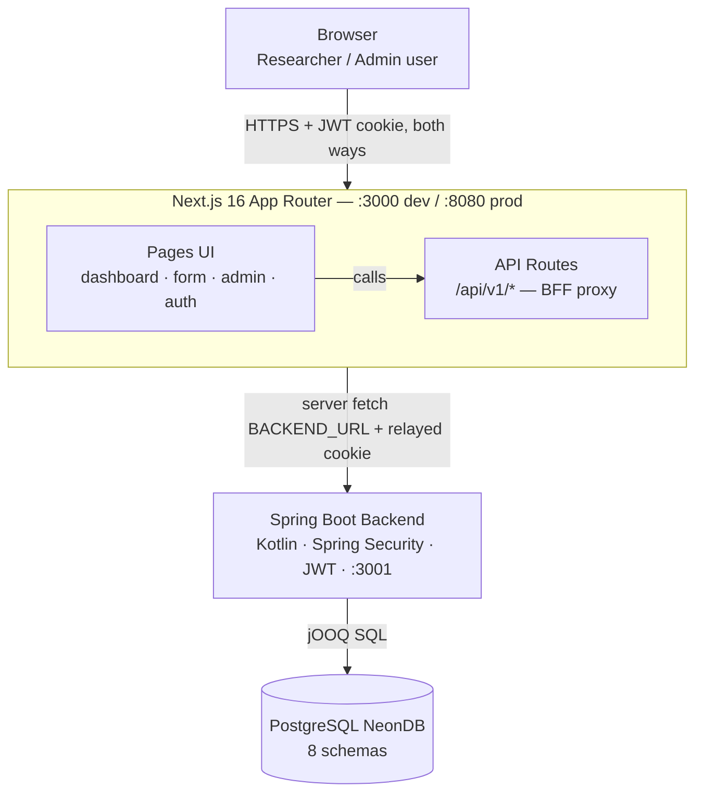

# Researcher Web App (Next.js)

**Location:** `cocoa_project_transfer/researcher-web-app-transfer-2026-05-16/` · **Stack:** Next.js 16, React 19, MUI 7, MapLibre, Chart.js, TypeScript, pnpm · **Talks to:** the Kotlin web backend

## Key design decision: server-proxied requests

The browser **never** calls the backend directly. Every request goes to the Next.js server, whose API routes (`/api/v1/*`) act as a **BFF proxy**, relaying the JWT cookie to the Kotlin backend:




Why:

1. `NEXT_PUBLIC_*` env vars are baked in at **build** time, which breaks the "one Docker image, configure at container start" model. Avoiding public env vars means the client can't know the backend URL — so the server must proxy.
2. Minor security win: the backend URI is never exposed to the client.

Keep this pattern when adding features — don't introduce `NEXT_PUBLIC_*` variables.

## Run locally

```bash
corepack enable        # Node.js LTS 20.9+
pnpm i
pnpm dev -p <port>
```

Quality check: `pnpm qc` — runs three gates in order: TypeScript (`tsc --noEmit`), ESLint, and Prettier. Tests: `npx playwright test tests/<test-file>` — five suites exist: login, landing, form, map, dashboard.

## Source layout (`src/`)

| Directory | Purpose |
|---|---|
| `app/` | Next.js App Router routes |
| `components/` | Global components |
| `core/` | Core types, constants, custom classes |
| `hooks/` | Global custom hooks |
| `libs/` | Global functions/libraries |
| `modules/` | Loosely-coupled feature modules |
| `providers/` | Global context providers |
| `stubs/` | Placeholder/testing values |
| `themes/` | MUI theme (`mainTheme`) |
| `proxy.ts` | Middleware (renamed from `middleware.ts` in Next.js 16) |

Debug routes exist under `/debug/*` (chart, download, guide, map, table, pathname, typography).

## Deployment options

1. **Docker (recommended):**

   ```bash
   docker build -t <image>:<tag> .
   docker container run -d -p 8080:8080 -e NODE_ENV=production \
     -e BACKEND_URL=<url> -e TOKEN_NAME=cocoa_web-jwt --name <name> <image>:<tag>
   ```

2. **AWS Elastic Beanstalk** — container preferred; source-bundle deploy requires switching pnpm → npm (delete `pnpm-lock.yaml`); a `Procfile` is included for that path.
3. **Manual VM** — nvm + standalone build (`NEXT_STANDALONE=true`, `pnpm build`) under `pm2`. See the original README's "Manual Deploy" section for the step-by-step.

No websockets are used — plain HTTP is enough at the load balancer.

## Known weak points (Phase 0 audit)

The team's [Researcher-Side Code Quality Audit](/docs/phase-0/researcher-audit) found 23 frontend issues — most importantly that **the registration flow is broken end-to-end** (BFF route never calls the backend, register button wired to nothing) and that **every 5xx response is misclassified** by the shared fetch helper. See [FE-1 to FE-9 in the Weak-Point Register](/docs/phase-0#3-researcher-web-app-nextjs). The backend endpoints this app calls are cataloged in the [API Reference](/docs/components/backend-api-reference).

## Known framework quirks (Next.js 16 / MUI)

- Complex objects can't be passed as props to server components: use a client-component `ThemeRegistry` instead of passing a theme object to `ThemeProvider` in the root layout.
- Passing MUI components via a `component` prop can error — see [MUI's Next.js 16 note](https://v7.mui.com/material-ui/integrations/nextjs/#next-js-v16-client-component-restriction).
- MUI v9 works but has TS Server / `tsconfig.json` init problems in VS Code — upgrade carefully, be ready to roll back.

## See also

- [Web Backend](/docs/components/backend-web) — the server this app proxies to, and its [API Reference](/docs/components/backend-api-reference)
- [Weak-Point Register — FE items](/docs/phase-0#3-researcher-web-app-nextjs)
- [Researcher-Side Code Audit](/docs/phase-0/researcher-audit) — all 23 frontend findings
