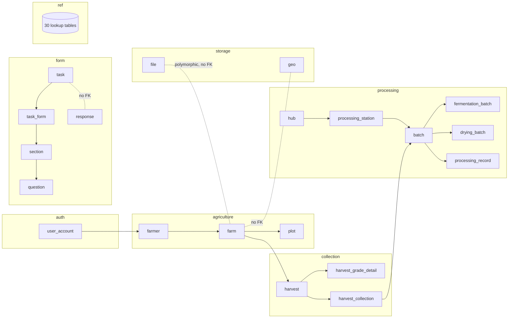
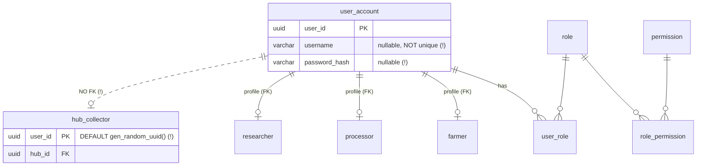
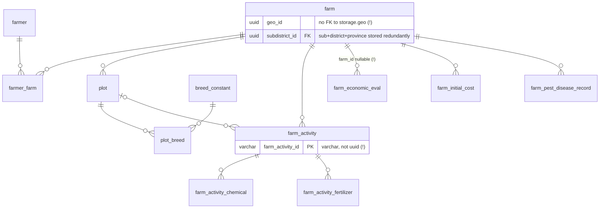
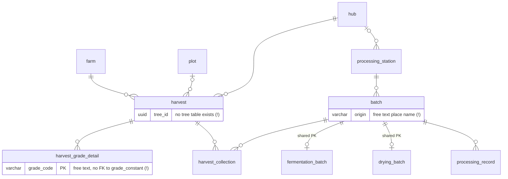
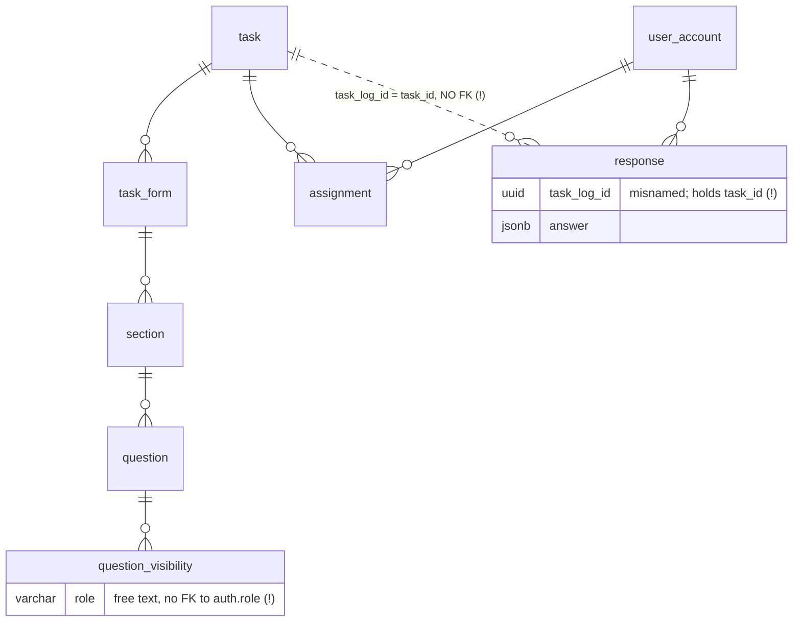

# Database Review — Cocoa Supply Chain Databank

:::info[Snapshot document]
Full review performed on **2026-07-08**. Preserved as-is for reference — for the current status of each finding, see the live [Critical Issues](/docs/critical-issues) tracker. Leave-vs-fix analysis for every finding is in [Fix Decisions](/docs/database/fix-decisions).
:::

**Scope:** `database/schema.sql` (65 tables, 8 schemas), `database/other.sql` (triggers), `database/seed.sql`, `backup.sql`
**Reviewed:** 2026-07-08

---

## 1. High-Level Architecture



Traceability chain: **farm → plot → harvest → harvest_collection → batch → fermentation/drying → processing_record**. The chain itself is sound and fully FK-enforced — this is the strongest part of the design.

---

## 2. Core ER Diagrams

### 2.1 Auth & Actor Profiles



Pattern: role-specific profile tables share the `user_account` PK (subtype pattern) — good. `hub_collector` breaks it: no FK to `user_account` and a `gen_random_uuid()` default on its PK, so a collector can exist with no login account (seed data happens to match, but nothing enforces it).

### 2.2 Agriculture



### 2.3 Collection → Processing (traceability)



### 2.4 Dynamic Forms



---

## 3. Good Points

**Clean domain separation.** 8 PostgreSQL schemas map one-to-one to business domains. Cross-schema FKs are used correctly. This makes access control and navigation easy.

**End-to-end traceability is FK-enforced.** Every hop from farm to processed batch has a real foreign key (80 FKs total). `harvest_collection` correctly models the M:N of harvests merging into batches.

**Consistent conventions.** `pk_*` / `fk_*` constraint naming, `snake_case`, `*_constant` suffix for lookups, `created_at`/`updated_at` on most transactional tables. jOOQ codegen benefits directly from this.

**Correct subtype patterns.** `fermentation_batch`/`drying_batch` share `batch_id` as PK+FK (proper 1:1 specialization). Actor profiles (`farmer`, `processor`, `researcher`) share `user_account.user_id` the same way.

**UUID PKs + pgcrypto.** Safe against ID enumeration, safe for offline/mobile inserts (relevant for the field-collection app).

**Sensible tech picks.** PostGIS `geometry(Geometry,4326)` for plot boundaries; `jsonb` for dynamic form answers/defaults — right tool for a form engine whose questions change.

**Proper M:N junctions with composite PKs** where it matters: `user_role`, `role_permission`, `farm_activity_chemical`, `farm_activity_fertilizer`, `harvest_grade_detail`.

**No data corruption found.** Seed data cross-checks clean: no orphaned profile users, `farm_constant` is in sync with `farm`, no orphaned `geo_id` references, no duplicate usernames *in the data* (though nothing enforces this — see below).

---

## 4. Bad Points

### Critical

**C1. `other.sql` is broken — repo cannot rebuild the DB.**
All four trigger functions in `other.sql` are truncated: bodies stop after the first `INSERT` branch, missing `ELSIF/END IF/RETURN NEW/END;$$`. The file is not valid SQL. The full versions exist only in `backup.sql`. Anyone doing "first time setup" from `database/` gets a failing script and, worse, if they skip it, the `ref.*_constant` mirror tables silently drift. README documents no migration tool, so these files ARE the source of truth — and the source of truth is corrupt.

**C2. `form.response.task_log_id` — misnamed column, no FK, no `task_log` table.**
Verified against seed data: all 21 distinct `task_log_id` values are `form.task.task_id` values (0 orphans vs `task`, 21/21 orphans vs `assignment`/`task_form`). So responses do link to tasks, but only by convention. There is no `task_log` table anywhere. Any developer reading the schema will look for one. Nothing stops a response pointing at a deleted or nonexistent task.

**C3. Zero UNIQUE constraints in the entire database.**
Confirmed in both `schema.sql` and the live dump. Consequences:
- `user_account.username` — duplicate logins possible; also nullable, as is `password_hash`.
- `role.role_name`, `permission.permission_key` — duplicate roles/permissions possible.
- Junctions with surrogate PKs (`farmer_farm`, `plot_breed`, `processor_processing_station`, `harvest_collection`) allow duplicate pairs — e.g. the same harvest linked to the same batch twice, double-counting quantity.
- Lookup tables allow duplicate names (`breed_constant` etc.), which then fragment reporting.

**C4. Zero secondary indexes.**
Only PK indexes exist. Every FK column is unindexed: `plot.farm_id`, `harvest.farm_id`, `batch.processing_station_id`, `question.section_id` (352 questions), `response.user_id`, etc. All the app's natural queries ("plots of this farm", "harvests of this hub") are sequential scans. Also no GiST index on `storage.geo.geom`, so PostGIS spatial queries can't use an index at all.

### Design integrity

**D1. `harvest.tree_id`** — dead column. No `tree` table exists, no FK, all-NULL in seed. Either an unimplemented feature or leftover; either way it misleads.

**D2. `storage.geo` unlinked.** `farm.geo_id`, `hub.geo_id`, `processing_station.geo_id` have no FK to `storage.geo(geo_id)`. Orphan geometry references possible (seed is currently clean).

**D3. `storage.file` polymorphic association** (`table_name` + `ref_id`) cannot be FK-enforced — deleting a farm strands its files with no DB-level signal. Acceptable trade-off for a generic file store, but it needs at least an index on `(table_name, ref_id)` and an application-level cleanup routine. Also has no `created_at`, unlike every other table.

**D4. Three grade representations, none connected.** `harvest_grade_detail.grade_code` is free-text varchar ('A'/'B'/'C' in seed); `ref.grade_constant` holds A/B/C with a `grade_id` uuid nobody references; `ref.cocoa_bean_grade_constant` is empty and referenced by nothing. One typo ('a', 'A ') creates a phantom grade.

**D5. Normalization conflict with the README.** README claims "higher normal forms", but:
- `subdistrict_id`, `district_id`, `province_id` are stored as a triple on 6 tables (farm, farmer, hub, processor, processing_station, hub_collector). Since subdistrict → district → province is a strict hierarchy (and FK-enforced in `ref`), district and province are transitively dependent — a farm can point at a subdistrict in one province and directly at a different province. Nothing checks the triple is consistent (3NF violation).
- `ref.farm_constant`, `hub_constant`, `plot_constant`, `processing_station_constant` are trigger-maintained duplicates of name columns in the live tables — deliberate denormalization, workable, but only as long as the triggers exist (see C1) and undocumented as an exception.

**D6. Unused/empty structures.** `ref.location_type_constant`, `ref.cocoa_bean_grade_constant`, `ref.fertilizer_application_stage_constant` are referenced by no FK and empty; `ref.processing_defect_constant` has seed rows but no table references it (a `batch_defect` junction is presumably missing). `form.question_visibility` exists but is empty, and its `role` column is free-text rather than an FK to `auth.role`.

### Consistency & types

**T1. `farm_activity.farm_activity_id` is `varchar`** — the only non-UUID PK among 65 tables, and it propagates into two junction tables. jOOQ will type it as String while everything else is UUID.

**T2. Timestamp types are mixed.** Everything is `timestamp without time zone` except `storage.geo.created_at` (`timestamptz`). For a system whose data is all in Thailand this mostly works, but pick one — `timestamptz` is the safe default.

**T3. Nullability is inconsistent.** `farm_economic_eval.farm_id` nullable (an evaluation of no farm is meaningless); `harvest.created_at/updated_at` nullable while all siblings are NOT NULL; address triple NOT NULL on `farm`/`farmer` but nullable on `hub_collector`/`processor`; `hub_collector.birthdate` vs `farmer.birth_date` naming.

**T4. Status/enum columns are unconstrained varchar** with no CHECK: `assignment.status`, `response.status`, `task.task_type`, `question.input_type`, `file.status`. No CHECK constraints exist anywhere (e.g. `quantity_kg >= 0`, `ends_at > started_at` on fermentation).

**T5. `farmer.agri_experience` is a `date` defaulting to `CURRENT_DATE`** — presumably "farming since", but the name says experience; every farmer who skips the field appears to have started farming today.

**T6. No `ON DELETE` behavior specified on any FK** (all default NO ACTION). Combined with the polymorphic file table, deleting anything with history requires manual cascade logic in the app.

**T7. `processing.batch.origin` is free-text** (Thai place names in seed) even though the harvest→batch link already encodes origin. Redundant and unverifiable.

### Operational

**O1. No migration tooling** (stated as a design decision). With three SQL files that have already diverged in quality (C1), this is the root cause of drift risk. `updated_at` also has no trigger to maintain it — it only ever equals `created_at` unless the app remembers to set it.

**O2. Seed reuses one bcrypt hash for all users** — fine for dev, dangerous if seed is ever applied near production.

---

## 5. Conflicts Worth Mentioning

1. **`other.sql` vs `backup.sql`** — same triggers, but repo copy is truncated/invalid (C1). The only complete definition of the sync triggers lives in an ad-hoc dump in the repo root.
2. **README vs seed** — README says roles are `ADMIN`, `RESEARCHER`, `COLLECTOR`; DB has lowercase `admin, researcher, farmer, hub_collector, processor`. Any code comparing role names case-sensitively against the README will fail.
3. **README "higher normal forms" vs actual schema** — see D5.
4. **`response.task_log_id` vs reality** — column name promises a `task_log` table that doesn't exist; data proves it's a `task_id` (C2).
5. **`grade_constant` vs `harvest_grade_detail`** — lookup exists but grading data bypasses it (D4).
6. **`ref` schema purity** — `ref` is documented as lookup data, but `farm_constant`/`plot_constant`/etc. are mirrors of transactional tables, and they FK *back into* `agriculture`/`processing`, inverting the expected dependency direction (ref should not depend on domain schemas).

No structural drift between `schema.sql` and `backup.sql` (identical tables, columns, 80 FKs each) — the two are in sync as of the dump.

---

## 6. Recommended Fixes (prioritized)

### P0 — do first

```sql
-- 1. Restore full trigger functions into other.sql (copy from backup.sql).

-- 2. Fix the response→task link
ALTER TABLE form.response RENAME COLUMN task_log_id TO task_id;
ALTER TABLE form.response
    ADD CONSTRAINT fk_response_task FOREIGN KEY (task_id) REFERENCES form.task(task_id);

-- 3. Identity integrity
ALTER TABLE auth.user_account
    ALTER COLUMN username SET NOT NULL,
    ALTER COLUMN password_hash SET NOT NULL,
    ADD CONSTRAINT uq_user_account_username UNIQUE (username);
ALTER TABLE processing.hub_collector
    ALTER COLUMN user_id DROP DEFAULT,
    ADD CONSTRAINT fk_hub_collector_user FOREIGN KEY (user_id) REFERENCES auth.user_account(user_id);
```

### P1 — integrity

```sql
-- Unique business keys
ALTER TABLE auth.role ADD CONSTRAINT uq_role_name UNIQUE (role_name);
ALTER TABLE auth.permission ADD CONSTRAINT uq_permission_key UNIQUE (permission_key);
ALTER TABLE agriculture.farmer_farm ADD CONSTRAINT uq_farmer_farm UNIQUE (farmer_id, farm_id);
ALTER TABLE agriculture.plot_breed ADD CONSTRAINT uq_plot_breed UNIQUE (plot_id, breed_id);
ALTER TABLE collection.harvest_collection ADD CONSTRAINT uq_harvest_batch UNIQUE (harvest_id, batch_id);
ALTER TABLE processing.processor_processing_station
    ADD CONSTRAINT uq_processor_station UNIQUE (processor_id, processing_station_id);

-- Link geometry
ALTER TABLE agriculture.farm ADD CONSTRAINT fk_farm_geo FOREIGN KEY (geo_id) REFERENCES storage.geo(geo_id);
ALTER TABLE processing.hub ADD CONSTRAINT fk_hub_geo FOREIGN KEY (geo_id) REFERENCES storage.geo(geo_id);
ALTER TABLE processing.processing_station ADD CONSTRAINT fk_ps_geo FOREIGN KEY (geo_id) REFERENCES storage.geo(geo_id);

-- Grades: reference the lookup (make grade name/code the natural key)
ALTER TABLE ref.grade_constant ADD CONSTRAINT uq_grade_name UNIQUE (grade_name);
ALTER TABLE collection.harvest_grade_detail
    ADD CONSTRAINT fk_hgd_grade FOREIGN KEY (grade_code) REFERENCES ref.grade_constant(grade_name);

-- Tighten nullability
ALTER TABLE agriculture.farm_economic_eval ALTER COLUMN farm_id SET NOT NULL;
ALTER TABLE collection.harvest ALTER COLUMN created_at SET NOT NULL, ALTER COLUMN updated_at SET NOT NULL;

-- Drop or implement: harvest.tree_id (no tree table)
ALTER TABLE collection.harvest DROP COLUMN tree_id;
```

### P2 — performance

```sql
-- Index every FK used in joins (representative set; generate the full list from information_schema)
CREATE INDEX idx_plot_farm ON agriculture.plot(farm_id);
CREATE INDEX idx_farmer_farm_farmer ON agriculture.farmer_farm(farmer_id);
CREATE INDEX idx_harvest_farm ON collection.harvest(farm_id);
CREATE INDEX idx_harvest_hub ON collection.harvest(hub_id);
CREATE INDEX idx_hc_harvest ON collection.harvest_collection(harvest_id);
CREATE INDEX idx_hc_batch ON collection.harvest_collection(batch_id);
CREATE INDEX idx_batch_station ON processing.batch(processing_station_id);
CREATE INDEX idx_precord_batch ON processing.processing_record(batch_id);
CREATE INDEX idx_section_form ON form.section(form_id);
CREATE INDEX idx_question_section ON form.question(section_id);
CREATE INDEX idx_response_user ON form.response(user_id);
CREATE INDEX idx_assignment_task ON form.assignment(task_id);
CREATE INDEX idx_assignment_user ON form.assignment(user_id);
CREATE INDEX idx_file_ref ON storage.file(table_name, ref_id);
CREATE INDEX idx_geo_geom ON storage.geo USING gist(geom);
```

### P3 — hygiene

- CHECK constraints on status columns (`assignment.status IN ('NOT_STARTED','IN_PROGRESS','COMPLETED')` etc.) and on quantities/date ranges.
- Standardize on `timestamptz`; add a shared `set_updated_at()` trigger.
- Migrate `farm_activity.farm_activity_id` to uuid (empty table — cheap to do now, expensive later).
- Decide the fate of dead objects: `location_type_constant`, `cocoa_bean_grade_constant`, `fertilizer_application_stage_constant`, `question_visibility` (or wire them up); add the missing junction for `processing_defect_constant`.
- Drop the address triple down to `subdistrict_id` only (derive district/province via joins), or add a composite FK to keep the triple consistent.
- Adopt a migration tool (Flyway fits the existing Gradle/jOOQ stack) so `schema.sql`/`other.sql`/`backup.sql` can't diverge again.
- Fix README role names (case) and document the `*_constant` mirror-table exception to the normalization claim.

---

## 7. Verification Notes

All findings were checked against the actual files: table/column parity between `schema.sql` and `backup.sql` confirmed programmatically (65 tables, 80 FKs, identical columns); `other.sql` truncation confirmed by direct read; absence of UNIQUE/INDEX/CHECK confirmed by grep of both schema and live dump; `task_log_id` ↔ `task_id` match, orphan checks, and constant-table sync verified against seed data.
