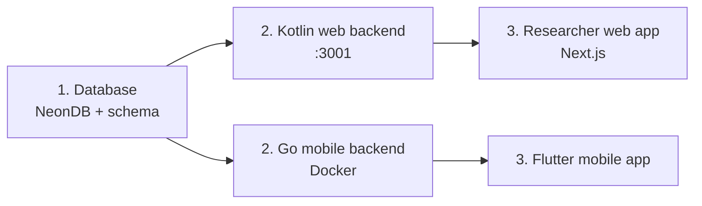

# Local Setup

Bring the system up in this order — everything depends on the database.



## 1. Database (PostgreSQL on NeonDB)

Full details: [Database component page](/docs/components/database).

1. Create a project + database at [neon.tech](https://neon.tech).
2. Enable extensions:

   ```sql
   CREATE EXTENSION IF NOT EXISTS pgcrypto;
   CREATE EXTENSION IF NOT EXISTS postgis;
   ```

3. Apply the schema:

   ```bash
   psql "postgresql://<user>:<password>@<host>/<dbname>?sslmode=require" -f schema.sql
   ```

4. Load seed data (optional): `psql "postgresql://..." -f seed.sql`

:::danger[Do NOT run other.sql as-is]

`other.sql` (the `ref.*_constant` sync triggers) is **truncated and not valid SQL** — the full trigger functions only exist in `backup.sql`, which sits at the CAPSTONE root **next to** (not inside) the transfer folder. Restore them from there first. See [Critical Issue C1](/docs/critical-issues#c1).

Extra trap: `backup.sql` is saved as **UTF-16** — convert before use or `psql`/grep will choke on it:

```bash
iconv -f UTF-16LE -t UTF-8 backup.sql > backup_utf8.sql
```

:::

## 2a. Kotlin web backend (`backend-web-transfer-2026-06-16/`)

Prerequisites: **JDK 21**, database from step 1.

1. Create `./src/.env` — the full variable list is on the [Web Backend page](/docs/components/backend-web#environment).
2. Generate jOOQ classes and run:

   ```bash
   ./gradlew generateJooq
   ./gradlew bootRun
   ```

3. Server: `http://localhost:3001/api/v1` — Swagger UI at `/api/v1/swagger-ui.html`.

Re-run `generateJooq` after every schema change.

## 2b. Go mobile backend (`go-server-transfer-2026-06-16/`)

Prerequisites: Docker + Docker Compose, and the `env` file configured.

```bash
docker compose up -d --build
```

## 3a. Researcher web app (`researcher-web-app-transfer-2026-05-16/`)

Next.js 16 + React 19, uses `pnpm`. The client never calls the backend directly — all requests proxy through the Next.js server (see [Researcher Web App](/docs/components/researcher-web) for why).

```bash
pnpm install
pnpm dev
```

Quality check before committing: `pnpm qc` (ESLint + TypeScript), tests with Playwright.

## 3b. Flutter mobile app (`cocoa-app-poc-0.2/`)

Prerequisites: Flutter 3.9+, Dart SDK ^3.9.2.

```bash
flutter pub get
flutter run
```

The app is **offline-first**: submissions queue locally with `pending` status and sync when connectivity returns — keep that in mind when testing against a local backend.

## Test accounts

Seed data creates users for every role, **all sharing one bcrypt hash** (dev only — never reuse seed near production). Role names in the live DB are lowercase: `admin`, `researcher`, `farmer`, `hub_collector`, `processor`.

:::warning
Old component READMEs claim roles are `ADMIN`, `RESEARCHER`, `COLLECTOR` — that is **wrong** (uppercase, and the set differs). Trust the database, not the old READMEs. See [Critical Issues](/docs/critical-issues#r2).
:::
