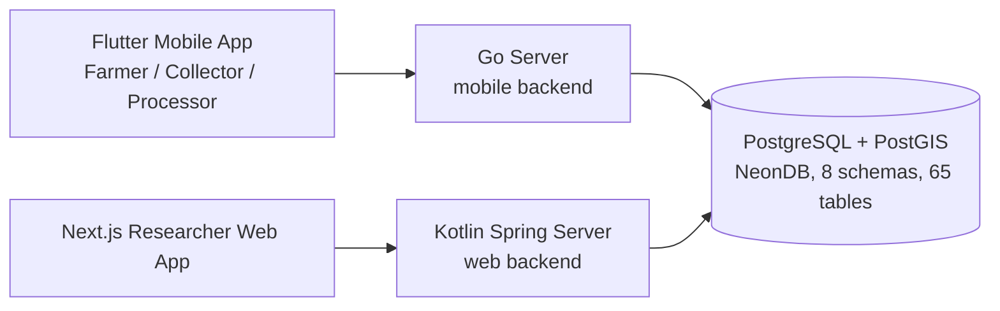

# Project Overview

**Databank for Cocoa Supply Chain** (ระบบฐานข้อมูลจัดเก็บสำหรับห่วงโซ่อุปทานของโกโก้; app name: **Is Thai Cacao**) is a capstone project that connects Thai cocoa farmers with researchers. It records the full journey of cocoa — farm registration, plots, harvests, collection, fermentation, drying, and processing — into one traceable databank, plus a dynamic-form engine so researchers can push new data-collection tasks to field users without code changes.

## Project phases

This capstone continues an inherited system through three official phases (details in the [Roadmap](/docs/plans/roadmap)):

| Phase | Goal |
|---|---|
| **Phase 0** *(current)* | Analyze the existing system: can it scale and support the later phases? → [Weak-Point Register](/docs/phase-0) |
| **Phase I** | Refactor the legacy system + database and **deploy it for real users** (maintainable, stable, scalable) |
| **Phase II** | LINE OA data-entry channel with **LLM** answer extraction for farmers |
| **Phase III** | **Computer Vision** (e.g. cocoa disease diagnosis) + **Knowledge Base** |

## Who uses it

| Role | What they do | Which app |
|---|---|---|
| **Farmer** (ฟาร์มเพาะปลูก) | Registers farms/plots, records harvests and farm activities | Flutter mobile app |
| **Collector** (หน่วยรวบรวม) | Aggregates harvests from farms into hubs | Flutter mobile app |
| **Processor** (สถานีแปรรูป) | Records batches, fermentation, drying, grading | Flutter mobile app |
| **Researcher** | Designs form tasks, views dashboards, maps, and analytics | Next.js web app |
| **Admin** | Manages users, roles, permissions | Direct DB / web app |

## System at a glance

Two separate backends talk to **one shared PostgreSQL database**. This makes the database the real contract between teams — which is why the [Database Review](/docs/database/db-review) and [Critical Issues](/docs/critical-issues) pages matter so much.

## Where the code lives

Everything was handed over in the `cocoa_project_transfer/` folder. Map of what's what:

| Path (under `cocoa_project_transfer/`) | What it is | Docs page |
|---|---|---|
| `database/` | `schema.sql`, `seed.sql`, `other.sql` (triggers) | [Database](/docs/components/database) |
| `backend-web-transfer-2026-06-16/` | Kotlin + Spring Boot + jOOQ web backend | [Web Backend](/docs/components/backend-web) |
| `go-server-transfer-2026-06-16/` | Go mobile backend (Clean Architecture) | [Go Server](/docs/components/go-server) |
| `researcher-web-app-transfer-2026-05-16/` | Next.js 16 researcher web app | [Researcher Web App](/docs/components/researcher-web) |
| `cocoa-app-poc-0.2/` | Flutter mobile app (offline-first) | [Mobile App](/docs/components/mobile-app) |
| `DB_REVIEW.md`, `DB_FIX_DECISIONS.md` | Database review + fix decisions (2026-07-08) | [Database Review](/docs/database/db-review) |
| `review_diagrams/`, `db_fix_roadmap.svg` | Architecture & DB diagrams | [Diagrams](/docs/architecture/diagrams) |
| `finalreport/`, `presentation/`, `Trip Feedback Documents/`, `คู่มือการใช้งาน/` | Legacy documents (reports, slides, manuals) | [Archive](/docs/archive) |
| `backup.sql` (repo root, next to the transfer folder) | Full DB dump — currently the only complete copy of the trigger functions | [Critical Issues](/docs/critical-issues) |

## Start here

1. **New to the project?** Read [Architecture Overview](/docs/architecture/overview), then the component page for the part you own.
2. **Setting up locally?** Follow [Local Setup](/docs/getting-started/local-setup) — the order matters (DB first).
3. **Working on Phase 0?** The [Weak-Point Register](/docs/phase-0) is the deliverable — all analyses feed into it, and every item needs a fix/accept decision.
4. **Before touching the database:** read [Critical Issues](/docs/critical-issues) and [Fix Decisions](/docs/database/fix-decisions). Several known traps are documented there (e.g. `other.sql` is broken, role names in old READMEs are wrong).
5. **Looking for an old document?** Check the [Archive](/docs/archive).
6. **Made a decision or finished a milestone?** Write it up in the [Project Log](/log).
