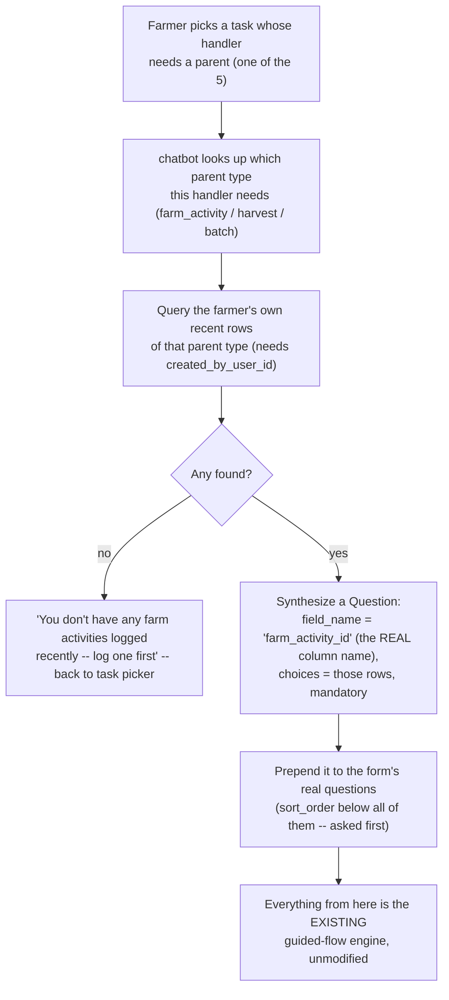

# Designing the 5 Blocked Handlers for the Chatbot

Design doc, not implementation. [Designing SubmitTask's Dissection Logic](/docs/plans/task-dissection-design) left one question explicitly open: `farm_activity_fertilizer`, `farm_activity_chemical`, `harvest_grade_detail`, `fermentation_batch`, `drying_batch` all need a parent ID that isn't in their own answer payload, and that doc named two options — **chained submission** vs. **reference by selection** — without picking one, deferring to "whoever owns the farmer-facing UX." This resolves that, for the chatbot channel specifically.

## The choice: reference by selection

**Chained submission** (submit the parent and detail together in one flow) doesn't fit a chat interface well:
- Farmers don't necessarily log a detail in the same sitting as the activity it belongs to — a farmer might log "I worked on the farm today" now, and remember to log "...and I used fertilizer X" hours or days later.
- It would need the guided-flow state machine to know "this task type is secretly two forms," breaking the current one-task-form-per-conversation model everything today is built on.
- An abandoned chat mid-flow (very plausible on LINE — someone closes the app, gets distracted) risks a half-submitted state across two tables instead of one.

**Reference by selection** ("which earlier entry is this for?") is a much more natural fit:
- It's just one more question in the existing guided flow, not a structural change.
- Each detail submission is its own independent conversation, decoupled in time from the parent.
- There's already a working precedent for exactly this shape of picker — `temp_task_picker.list_pending_tasks` (a DB query rendered as LINE Quick Reply buttons).

**Recommendation: reference by selection.** Chained submission might still be the right call for the *mobile app*, where a single screen could plausibly show both forms — but that's a separate decision for that channel, not this one.

## The gap this design has to close first

The obvious version of "show the farmer their own recent farm activities" turns out not to be implementable today — verified against the live schema, none of `agriculture.farm`, `agriculture.farm_activity`, `collection.harvest`, or `processing.batch` records **who created the row**:

```
agriculture.farm_activity: farm_activity_id, farm_id, plot_id, farm_activity_type_id, description, created_at, updated_at
collection.harvest:        harvest_id, hub_id, farm_id, plot_id, tree_id, harvest_date, created_at, updated_at
processing.batch:          batch_id, processing_station_id, origin, notes, quantity_kg, created_at, updated_at
```

The farmer's identity is only ever recorded on `form.response.user_id` — and there's no FK from there back to the domain row a submission actually created. So "the farmer's own recent entries" can't be queried at all right now, for any of the 3 parent types this design needs.

**Fix: a small migration adding `created_by_user_id` to the 3 parent tables** (`agriculture.farm_activity`, `collection.harvest`, `processing.batch`), nullable, FK to `auth.user_account`. Go already has the resolved `userID` in scope at insert time (`submitAnswerForUser`'s existing parameter) — populating it is a one-line addition to the already-designed generic dissection path, not new plumbing.

**Open question, not assumed here:** does "batch" ownership mean *the person who created it* the same way farm_activity does, or *anyone working at that processing station*? A farm activity and a harvest both trace back to one farm, plausibly one farmer's. A processing batch belongs to a station, which multiple staff might work at — "my own batches" could be the wrong scope entirely for fermentation/drying details. This needs an answer from whoever owns the processing/station side of the product before that part ships; the farm_activity and harvest cases don't have this ambiguity.

## The core mechanism: a synthetic first question, not a new code path

Rather than building a separate "pick a parent" UI step bolted onto the guided flow, treat it as **one more `Question`** the existing engine already knows how to ask — synthesized client-side instead of coming from Kotlin's form definition, but flowing through every downstream mechanism (`handle_answer`, choice resolution, skip logic, `conversation_answer` storage, the final payload) completely unchanged.



The field_name trick is what makes this cheap: because the synthetic question's `field_name` is set to the real destination column (`farm_activity_id`, `harvest_id`, or `batch_id`), the picked value lands in `confirm_conversation`'s payload dict via the exact same `{field_name: value}` construction every other answer already goes through — no special-casing needed at confirm time, no new column on `chat.conversation` to carry it separately.

## Per-handler parent mapping

| Handler | Parent type | Parent field_name | Picker query source (after the migration) |
|---|---|---|---|
| `farm_activity_fertilizer` | farm activity | `farm_activity_id` | `agriculture.farm_activity` WHERE `created_by_user_id` = farmer |
| `farm_activity_chemical` | farm activity | `farm_activity_id` | same as above |
| `harvest_grade_detail` | harvest | `harvest_id` | `collection.harvest` WHERE `created_by_user_id` = farmer |
| `fermentation_batch` | processing batch | `batch_id` | `processing.batch` WHERE `created_by_user_id` = farmer *(pending the ownership-scope question above)* |
| `drying_batch` | processing batch | `batch_id` | same as above |

Both farm-activity children share one picker (a farmer picks the activity once, whether they're then asked about fertilizer or chemical use), and both batch children share the other — the picker step is per parent-type, not per handler.

Recency/limit: match `temp_task_picker`'s existing convention — most-recent-first, capped at 13 (LINE's own Quick Reply limit). No extra date filtering proposed beyond that; a farmer's own row count is naturally small enough that "13 most recent" already keeps the list relevant without needing a separate time window.

Display label per choice: the raw domain rows have no farmer-friendly title (`farm_activity` has no name field, just FK's and a free-text description). Proposed label: formatted date + activity type name (e.g. "กิจกรรม 09/08/2026 — ใส่ปุ๋ย"), resolving `farm_activity_type_id` through `ref.farm_activity_type_constant` the same way OPTION choices already resolve everywhere else. Exact wording is a small detail, not a blocker.

## What Go actually needs

Surprisingly little, once the above is in place. The parent ID arrives as a normal field in the answer payload (same as any other field), so [the already-designed generic dissection path](/docs/plans/task-dissection-design#design-the-generic-path-5-standalone-handlers) needs **no new logic** — just extending its handler→table map to include these 5:

```go
var handlerTables = map[string]string{
	// existing 5...
	"farm_activity_fertilizer": "agriculture.farm_activity_fertilizer",
	"farm_activity_chemical":   "agriculture.farm_activity_chemical",
	"harvest_grade_detail":     "collection.harvest_grade_detail",
	"fermentation_batch":       "processing.fermentation_batch",
	"drying_batch":             "processing.drying_batch",
}
```

The existing `liveColumns` allowlist already protects this the same way it protects everything else — `farm_activity_id` only lands in the INSERT because it's a real column on `agriculture.farm_activity_fertilizer`, filtered in exactly like `fertilizer_id` or `notes` already are. One thing worth double-checking when this is actually built: `harvest_grade_detail`'s destination column is `grade_code` (a natural-key text column referencing `ref.grade_constant.grade_name`, not a UUID surrogate key) — already flagged separately in the [Weak-Point Register, CB-5](/docs/phase-0#7-chatbot--line-oa-pathway-phase-ii) as needing its own fix, unrelated to the parent-picker problem this doc solves.

## Sequencing

1. Decide the batch-ownership question above (personal vs. station-scoped) — blocks `fermentation_batch`/`drying_batch` specifically, not the other 3.
2. Migration: add `created_by_user_id` to `agriculture.farm_activity`, `collection.harvest`, `processing.batch`.
3. Go: populate it on insert (one line, already-resolved `userID` in scope) for the 5 already-working standalone handlers — this alone unblocks nothing new yet, but every row created *after* this point is pickable; rows created before it are not (backfill isn't possible, the data to backfill from doesn't exist).
4. Go: extend `handlerTables` with the 5 blocked handlers — per the existing generic path, no new code beyond the map entries.
5. Chatbot: the synthetic-question mechanism (parent-type lookup, picker query, prepend-to-question-list) plus the "no parent entries yet" fallback message.

Steps 2-4 are independent of the chatbot and could ship on their own; step 5 is the only chatbot-side work and depends on 2-3 being live first (there's nothing to pick until real rows carry `created_by_user_id`).

## Related

- [Designing SubmitTask's Dissection Logic](/docs/plans/task-dissection-design) — the generic dissection path this extends, and where the open question this doc resolves was first raised
- [Backend Fixes Needed for the Chatbot Project](/docs/plans/backend-fix-proposal) — where the dissection gap was first flagged
- [Weak-Point Register, section 7](/docs/phase-0#7-chatbot--line-oa-pathway-phase-ii) — CB-6 (this design was logged there as a placeholder) and CB-5 (the `grade_code` naming issue noted above)
