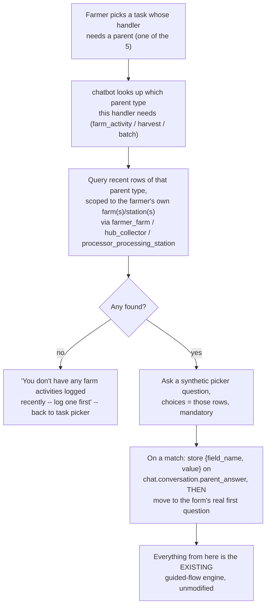

# Designing the 5 Blocked Handlers for the Chatbot

Design doc, not implementation. [Designing SubmitTask's Dissection Logic](/docs/plans/task-dissection-design) left one question explicitly open: `farm_activity_fertilizer`, `farm_activity_chemical`, `harvest_grade_detail`, `fermentation_batch`, `drying_batch` all need a parent ID that isn't in their own answer payload, and that doc named two options — **chained submission** vs. **reference by selection** — without picking one, deferring to "whoever owns the farmer-facing UX." This resolves that, for the chatbot channel specifically.

**Updated after checking with เป็นเอก สิทธิมงคล (original schema designer), who answered directly and changed the core assumption below** — see "Visibility scope" for what changed and why.

## The choice: reference by selection

**Chained submission** (submit the parent and detail together in one flow) doesn't fit a chat interface well:
- Farmers don't necessarily log a detail in the same sitting as the activity it belongs to — a farmer might log "I worked on the farm today" now, and remember to log "...and I used fertilizer X" hours or days later.
- It would need the guided-flow state machine to know "this task type is secretly two forms," breaking the current one-task-form-per-conversation model everything today is built on.
- An abandoned chat mid-flow (very plausible on LINE — someone closes the app, gets distracted) risks a half-submitted state across two tables instead of one.

**Reference by selection** ("which earlier entry is this for?") is a much more natural fit:
- It's just one more question in the existing guided flow, not a structural change.
- Each detail submission is its own independent conversation, decoupled in time from the parent.
- There's already a working precedent for exactly this shape of picker — `temp_task_picker.list_pending_tasks` (a DB query rendered as LINE Quick Reply buttons).

**Recommendation: reference by selection.** Chained submission might still be the right call for the *mobile app*, where a single screen could plausibly show both forms — but that's a separate decision for that channel, not this one.

## Visibility scope — resolved, and it changed the design

The first draft of this doc assumed "show the farmer their own recent entries," which meant proposing a new `created_by_user_id` column on the 3 parent tables, since nothing recorded who created a row. Checked directly with the original schema designer before building on that assumption — the real answer is different on both counts:

**Scope is organization/farm-level, not per-creator.** Direct quote (translated): *"คนที่รับผิดชอบฟาร์มเดียวกัน ควรเห็นเหมือนๆกันหมด เพราะมันคือข้อมูลของฟาร์มเรา"* — "people responsible for the same farm should see everything the same, because it's our farm's data." Explicitly confirmed this applies to all 5 handlers, not just batches, and the reasoning is real: multiple workers routinely help fill in the same farm's records, especially at hubs during buying/grading, where it's described as heavy enough work that it needs several people contributing. The rule as given: same farm → shared visibility; different farm (even literally next door) → no visibility into each other's data at all.

**No new column needed.** The ownership chain already exists in the schema, just not as a direct FK on the 3 parent tables themselves — it's derivable through the existing membership join tables, confirmed populated with real rows:

| Parent type | Membership join table | Shape |
|---|---|---|
| `farm_activity`, `harvest` (farm side) | `agriculture.farmer_farm` (16 rows) | `farmer_id` ↔ `farm_id`, many-to-many |
| `harvest` (hub side) | `processing.hub_collector` | `user_id` + `hub_id` directly on the row |
| `batch` | `processing.processor_processing_station` (3 rows) | `processor_id` ↔ `processing_station_id`, many-to-many |

`agriculture.farmer.user_id` and `processing.processor.user_id` map directly to `auth.user_account.user_id`, so the full chain from a logged-in farmer to "which farms am I on" is a join away, not new data. The `created_by`/`created_at`/`updated_by`/`updated_at` audit columns are still worth having on every table generally (asked for independently, "จะดีมาก" — "would be great") but are not a blocker for this specific picker — they'd tell you *who* filed a given row, not *who's allowed to see it*, which is a different question the membership tables already answer.

## The core mechanism: a synthetic first question, mostly not a new code path

Rather than building a separate "pick a parent" UI step bolted onto the guided flow, treat it as **one more question** the existing engine already knows how to ask — synthesized client-side instead of coming from Kotlin's form definition, flowing through most of the same downstream mechanism (`handle_answer`, choice resolution, the LINE Quick Reply rendering) as a real question.



**Correction from the first draft of this doc, found while building it:** the plan above originally said the synthetic question could reuse `Question`/`ConversationAnswer` completely unchanged, needing "no special-casing at confirm time, no new column on `chat.conversation`." That turned out not to hold: `chat.conversation_answer.question_id` has a real foreign key to `form.question.question_id`, and the picker's synthetic question has no corresponding row there (it's built client-side, not part of any form definition) — so inserting a normal `ConversationAnswer` for it fails the FK at the database level, not just in theory.

What was actually built instead: the picker step lives entirely in `chat.conversation.current_question_id` (which has no such FK) via a small set of fixed, well-known UUIDs (`src/line/parent_picker.py`'s `SENTINEL_QUESTION_ID`) — one per parent type, never a real `form.question` row. When the farmer picks a choice, the resolved `{field_name, value}` pair is stored on a new nullable column, `chat.conversation.parent_answer` (`database/migrations/V13__conversation_parent_answer.sql`), instead of as a `ConversationAnswer` row. `confirm_conversation` merges it into the submission payload alongside the form's real answers at the very end, using the same `{field_name: value}` shape every other answer already uses — so the field_name trick itself still holds, just one layer later than originally planned.

## Per-handler parent mapping and picker query shape

| Handler | Parent type | Parent field_name | Picker query (organization-scoped) |
|---|---|---|---|
| `farm_activity_fertilizer` | farm activity | `farm_activity_id` | `agriculture.farm_activity` JOIN `agriculture.farmer_farm` ON `farm_activity.farm_id = farmer_farm.farm_id` WHERE `farmer_farm.farmer_id` = requesting farmer |
| `farm_activity_chemical` | farm activity | `farm_activity_id` | same as above |
| `harvest_grade_detail` | harvest | `harvest_id` | **built as a union of both sides**, not a single choice — see note below |
| `fermentation_batch` | processing batch | `batch_id` | `processing.batch` JOIN `processing.processor_processing_station` ON `batch.processing_station_id = processor_processing_station.processing_station_id` WHERE `processor_processing_station.processor_id` = requesting user |
| `drying_batch` | processing batch | `batch_id` | same as above |

Both farm-activity children share one picker (a farmer picks the activity once, whether they're then asked about fertilizer or chemical use), and both batch children share the other — the picker step is per parent-type, not per handler.

Recency/limit: match `temp_task_picker`'s existing convention — most-recent-first, capped at 13 (LINE's own Quick Reply limit). Given the scope is now organization-wide rather than one person's own entries, the farm/station's total row count could plausibly be larger than one farmer's own would have been — worth re-checking this cap is still enough once real usage volume is known, rather than assuming.

Display label per choice: the raw domain rows have no farmer-friendly title (`farm_activity` has no name field, just FK's and a free-text description). Built as: formatted date + activity type name + farm/station name (e.g. "กิจกรรม 09/08/2026 — ไร่โกโก้สุขใจ"), resolving `farm_activity_type_id` through `ref.farm_activity_type_constant` the same way OPTION choices already resolve everywhere else. Showing who logged it (e.g. "...— บันทึกโดย สมชาย") was left out — there's no `created_by` column on any of these tables yet (see "What Go actually needs" below), so there's no data to show. Worth adding once that column exists; not a blocker today.

**`harvest_grade_detail`'s visibility, resolved by construction rather than by decision:** `collection.harvest` carries both `farm_id` and `hub_id` on every row (confirmed live), so rather than waiting on a product decision about which side actually does the grading, the picker shows the **union** of both: a harvest is offered if the requester is on its farm (`farmer_farm`) *or* works at its hub (`hub_collector`). Showing an extra choice the farmer just ignores is a much smaller problem than hiding the right one behind a guess. Worth narrowing to one side later if it turns out the other never applies in practice — but nothing is blocked on that now.

## What Go actually needs

Simpler than the first draft of this doc proposed — no ownership column to populate, since visibility is resolved entirely on the read/picker side (chatbot querying which parent rows to offer), not by tagging rows on write. The parent ID arrives as a normal field in the answer payload once picked (same as any other field), so [the already-designed generic dissection path](/docs/plans/task-dissection-design#design-the-generic-path-5-standalone-handlers) needs **no new logic** — just extending its handler→table map to include these 5:

```go
var handlerTables = map[string]string{
	// existing 5...
	"farm_activity_fertilizer": "agriculture.farm_activity_fertilizer",
	"farm_activity_chemical":   "agriculture.farm_activity_chemical",
	"harvest_grade_detail":     "collection.harvest_grade_detail",
	"fermentation_batch":       "processing.fermentation_batch",
	"drying_batch":             "processing.drying_batch",
}
```

The existing `liveColumns` allowlist already protects this the same way it protects everything else — `farm_activity_id` only lands in the INSERT because it's a real column on `agriculture.farm_activity_fertilizer`, filtered in exactly like `fertilizer_id` or `notes` already are. One thing worth double-checking when this is actually built: `harvest_grade_detail`'s destination column is `grade_code` (a natural-key text column referencing `ref.grade_constant.grade_name`, not a UUID surrogate key) — already flagged separately in the [Weak-Point Register, CB-5](/docs/phase-0#7-chatbot--line-oa-pathway-phase-ii) as needing its own fix, unrelated to the parent-picker problem this doc solves.

Whether Go itself should re-verify the picked parent ID actually belongs to the farmer's organization (defense in depth, in case the chatbot's own picker query has a bug or the client is compromised) is worth deciding when this is built — the same kind of check `SubmitTaskForUser` already does via `chat.conversation` for the task itself.

## Sequencing

1. ~~Confirm which side governs `harvest_grade_detail` visibility~~ — **resolved by construction, not decision**: the picker shows the union of both `farmer_farm` and `hub_collector` membership, so no product answer was needed to unblock this. See the note under "Per-handler parent mapping" above.
2. ~~Chatbot: the synthetic-question mechanism~~ — **built**: `src/line/parent_picker.py` (the 3 scoped queries + choice formatting), plus `src/conversation/service.py`'s `start_conversation`/`handle_answer`/`confirm_conversation` changes and the new `chat.conversation.parent_answer` column (`V13`). The pre-flight block in `src/line/router.py` (`_UNSUPPORTED_HANDLERS`) that used to refuse these 5 outright has been removed. Verified against live data: two different farmers' `farm_activity` choice lists don't overlap.
3. ~~Go: extend `handlerTables` with the 5 blocked handlers~~ — **built**: `mobile-backend/internal/handlers/form_handler.go`'s `standaloneHandlerTables` now has all 10 handlers; `go build`/`go vet`/`go test ./...` all pass.
4. Optional, worth deciding but not blocking: `created_by`/`updated_by`/timestamps on more tables generally, per the designer's own suggestion — separate from this picker, since it answers "who filed this" rather than "who's allowed to see it."
5. Not yet done: a full live run through the real LINE webhook (both services running behind the tunnel) — everything above is verified via the unit-test suite (28 passing in chatbot, full Go suite passing) and direct queries against the live dev database, but not yet clicked through LINE itself end to end.

## Related

- [Designing SubmitTask's Dissection Logic](/docs/plans/task-dissection-design) — the generic dissection path this extends, and where the open question this doc resolves was first raised
- [Weak-Point Register, section 7](/docs/phase-0#7-chatbot--line-oa-pathway-phase-ii) — CB-6 (this design was logged there as a placeholder) and CB-5 (the `grade_code` naming issue noted above)
