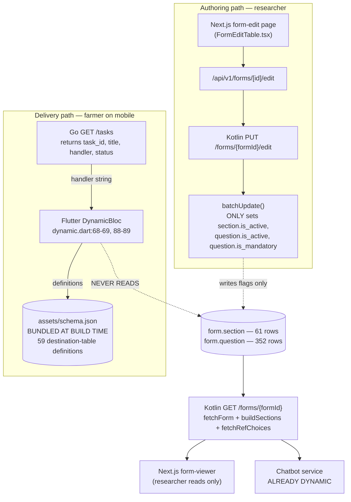
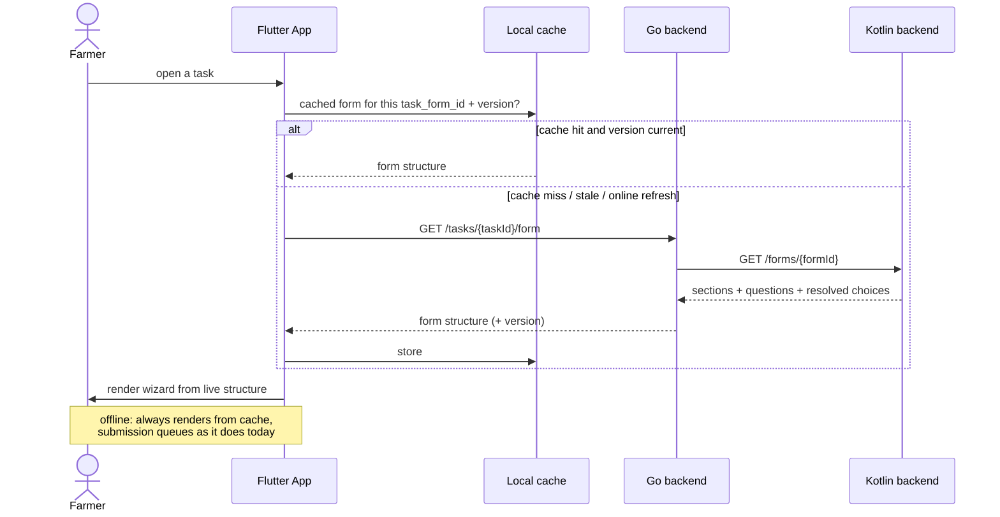

# Making the Form Maker Actually Dynamic

A concrete proposal for closing the headline finding of the Phase 0 review — the "dynamic form engine" that is missing both ends. Everything below was re-verified against the live database and the actual source of all three repos before writing; findings that correct our own earlier docs are flagged at the bottom.

:::tip[Read this first — it changes the priority]
**The chatbot does not need this work to function.** The chatbot reads form structure from Kotlin's `GET /forms/{formId}` ([ADR 0001](/docs/adr/old-new-integration-seam)), which already queries `form.section`/`form.question` live. So the chatbot channel is dynamic **the day it ships**, with none of the changes below.

What this work actually buys:
1. The **mobile app** honors form changes (today it cannot, at all).
2. **Researchers can create a form without a developer running SQL** (today they cannot, at all).

Both are real and both were promised in the final report — but neither is on the critical path for Phase I's chatbot. Treat this as its own scoped effort, not a chatbot blocker.
:::

## What actually happens today

Verified end-to-end against live code and data:



The two ends that are missing:

**Gap A — there is no authoring.** No `POST` exists anywhere for `form.task`, `form.task_form`, `form.section`, or `form.question` — not in Kotlin, not in the Next.js BFF. And the one write path that does exist is far narrower than "edit":

| What the edit endpoint accepts | What it actually writes |
|---|---|
| `Section.Request.Edit`: `sectionId`, `description`, `isActive`, `questions[]` | `SectionRepository.batchUpdate` sets **`is_active` only** |
| `Question.Request.Edit`: `questionId`, `description`, `isActive`, `isMandatory` | `QuestionRepository.batchUpdate` sets **`is_active` + `is_mandatory` only** |

So `description` is accepted in both DTOs and **silently discarded** — a real bug, not just a gap. You cannot change a question's label, input type, field name, or sort order through the API at all. The "form editor" is a visibility toggler. All 82 `task_form` rows and 352 questions were inserted by hand via SQL.

**Gap B — there is no live delivery.** The Flutter app reads `assets/schema.json` keyed by the `handler` string, which describes **the destination table's columns** — not the researcher-authored questions. Nothing in the Flutter codebase ever reads `form.section`/`form.question`. Editing a form has zero effect on any phone until a developer edits the bundled file and ships a new build.

## The crux: two incompatible shapes

This is why Gap B isn't a one-line fix. The two structures describe different things:

```
assets/schema.json (bundled)          form.section / form.question (live)
─────────────────────────────         ────────────────────────────────────
definitions[handler]                   form
  .properties[column_name]               └── sections[]  (sort_order, is_active)
      .type      ("string"|"option")           └── questions[]
      .is_required                                   .label        ← human text
      .placeholder                                   .input_type   (VARCHAR|OPTION|
      .is_key                                                       FLOAT|GEODATA|
      .is_from_input                                                BOOLEAN|DATETIME|
                                                                    DATE|INT)
KEYED BY: database column                            .field_name   ← destination column
FLAT, no order, no labels,                           .sort_order
no sections, no per-form                             .is_mandatory
concept at all                                       .choices[]    ← resolved server-side
                                        NESTED, ordered, labelled, per-form
```

The live shape is strictly richer. `question.field_name` is the bridge between them — it names which destination column an answer lands in (e.g. `province_id`), and Kotlin's `fetchRefChoices` resolves `<x>_id` → `ref.<x>_constant` → `<x>_name*` to build the dropdown options.

**`schema.json` should not simply be deleted.** It is the only existing machine-readable catalog of "which columns exist on each destination table," which the form builder in Gap A needs in order to offer valid `field_name` choices. Repurpose it server-side (see Part 3), don't discard it.

## Part 1 — Delivery: make mobile read the live form

### Who serves the structure to mobile?

Mobile talks only to Go today. Three options:

| Option | Pro | Con |
|---|---|---|
| **B1. Go proxies to Kotlin** (recommended) | One assembly implementation, consistent with [ADR 0001](/docs/adr/old-new-integration-seam)'s reuse-don't-rebuild decision | Needs Go→Kotlin service auth (**same unresolved question ADR 0001 already flagged**); mobile gains a runtime dependency on Kotlin |
| B2. Go queries the DB and assembles itself | No cross-service call | Duplicates `buildSections`/`fetchRefChoices` — this *is* `GO-1` split-brain, the risk the review named as the single biggest architectural problem |
| B3. Flutter calls Kotlin directly | No Go work | Two base URLs and two auth systems in the app; worst of both |

**Recommend B1.** It keeps Kotlin as the single form-structure authority for all three clients (web viewer, chatbot, mobile). It inherits one open dependency: how Go authenticates to Kotlin on a farmer's behalf — the exact caveat already recorded in ADR 0001, still undecided.

### Offline is a hard requirement — fetch **and cache**, don't just fetch

The mobile app is offline-first by design (remote farms, unstable connectivity). Replacing "read bundled file" with "fetch from network" would **regress** that: a farmer with no signal could no longer open a form at all.

The correct replacement is **fetch → cache locally → render from cache**, with the bundled file removed. This is a smaller conceptual change than it sounds — the app already caches via `SharedPreferences`; the form structure just becomes one more cached resource with a refresh policy.

This immediately raises the staleness question, which is what makes versioning load-bearing:



### Concrete changes

**`mobile-backend` (Go)**
- New route: `GET /tasks/:taskId/form` in `cmd/main.go` (protected group).
- New handler method on `FormHandler`: look up `task_form.form_id` for the task, call Kotlin, return the payload. Include the form's `version` in the response so the app can cache-bust.
- New config: Kotlin's base URL + whatever service credential the auth decision lands on.
- Depends on: the Go→Kotlin auth decision (open, ADR 0001).

**`web-backend` (Kotlin)**
- `GET /forms/{formId}` currently requires `read:form:all`, a researcher permission. A farmer-originated call has no such authority. Needs either a service-account path or a new narrower permission — **same decision as the chatbot's, resolve once for both.**
- Worth doing at the same time: `fetchRefChoices` calls `dsl.meta().tables` (full schema introspection) **per option field, per request** (`BE-5`). The web app hits this occasionally; mobile + chatbot will hit it on every form open. Cache it.

**`mobile-app` (Flutter)**
- `lib/bloc/dynamic/dynamic.dart`: replace both `rootBundle.loadString('assets/schema.json')` calls (`:68-69` in `LoadSchemaAndData`, `:88-89` in `SubmitForm`) with a call to the new endpoint, backed by cache.
- Rewrite the render loop: iterate `sections[] → questions[]` in `sort_order`, instead of iterating a table's columns. Use `label` for display (today there is no label at all — the app shows column names).
- Map the **8** live `input_type` values to widgets: `VARCHAR` (132 uses), `OPTION` (106), `FLOAT` (50), `GEODATA` (35), `BOOLEAN` (22), `DATETIME` (4), `DATE` (2), `INT` (1). `OPTION` renders `choices[]` as supplied by the server — the app no longer resolves reference data itself.
- Delete `assets/schema.json` from the bundle **only after** the server-side catalog in Part 3 exists, since it is the source for that catalog.
- Keep the existing offline submission queue untouched — this change is read-path only.

## Part 2 — Authoring: make form creation possible

### Database

Per [ADR 0005](/docs/adr/data-model-changes), `form.task_form` gains `version` + `is_active`, and `form.response` gains `task_form_id`. Two corrections to that ADR's stated reasoning, based on the live schema:

- ADR 0005 says this matches an "existing `section`/`question` `version`/`is_active` convention." **Only half true** — `section` and `question` have `is_active`, but **neither has a `version` column**. Versioning is genuinely net-new, not a convention being extended.
- 21 of 82 `task_form` rows have **no sections at all** and are invisible to `fetchForms` (which filters on `whereExists(SECTION)`). Any create/edit flow should decide explicitly whether a section-less form is legal, rather than inheriting that silent filter.

### Kotlin — the real work

New endpoint, one nested transactional payload rather than per-entity endpoints (a form with sections but no questions is a meaningless intermediate state):

```
POST /forms
  { title, description, taskType, openAt, closeAt, handler,
    sections: [ { title, description, sortOrder,
                  questions: [ { label, description, inputType, fieldName,
                                 isMandatory, sortOrder, defaultValue } ] } ] }
  → creates form.task + form.task_form + form.section[] + form.question[] in ONE transaction
```

Plus a **real** `PUT /forms/{formId}` that writes the fields the current one ignores (`label`, `input_type`, `field_name`, `sort_order`, `description`), and supports adding/removing sections and questions — not just flipping `is_active`. Keep the existing narrow toggle endpoint or fold it in; either way, fix the silently-discarded `description`.

Also needed: a `create:form:all` permission. Today `auth.permission` contains only `read:form:all` and `update:form:all` — verified. Add it via a Flyway migration alongside the role grant.

### Next.js — the biggest UI chunk

A `form-create` route (none exists — only `form-edit` and `form-viewer`), plus a builder UI and the matching BFF proxy route under `src/app/api/v1/forms/`.

Scope recommendation, cheapest useful first:
1. **Structured builder, not drag-and-drop.** Add section → add question → pick type/label/required/order via plain form controls. Drag-and-drop is a large amount of work for a researcher-facing tool used occasionally.
2. **"Duplicate this form" is the highest value-per-effort feature here.** There are already 82 forms and 10 handlers; researchers almost certainly want variants of what exists rather than blank-page creation. This is a single `POST /forms` call pre-filled from an existing form's `GET` response — nearly free once `POST /forms` exists, and it may cover the majority of real usage.

## Part 3 — The constraint that ties both parts together

A form builder cannot let researchers type `handler` and `field_name` freely. Both are load-bearing:

- **`handler`** must match one of the values Go's `SubmitTask` switch knows, or the submission silently falls through to the `default` branch. Verified live values: `farm_activity`, `processing_record`, `farm_pest_disease_record`, `farm_activity_fertilizer`, `farm_activity_chemical`, `harvest`, `harvest_grade_detail`, `fermentation_batch`, `batch`, `drying_batch`. **Must be a dropdown of known handlers, never free text.**
- **`field_name`** must name a real column on that handler's destination table, or the answer has nowhere to land during dissection. **Must be a dropdown of that handler's valid columns.**

This is exactly what `assets/schema.json` already contains — a 59-table map of table → columns → types. So the recommended move is to **promote it from a client-side bundle to a server-side catalog**: expose `GET /forms/handlers` and `GET /forms/handlers/{handler}/fields` from Kotlin, sourced either from that file or (better) from live schema introspection. The builder consumes it; the phone no longer needs it.

:::warning[This proposal assumes dissection gets fixed]
Everything above is about getting the right *questions* to the farmer and the right *answers* back. It does **not** fix the separate, verified bug that Go's `SubmitTask` dissection is a stub (`fmt.Println` per case, no `INSERT` into any domain table — `form_handler.go:99-106`). A perfectly dynamic form whose answers never reach the domain tables is still broken. See the [backend fix proposal](/docs/plans/backend-fix-proposal) and the full [dissection design](/docs/plans/task-dissection-design) — that design is independent of this one and unblocked today, it doesn't need to wait on the delivery/authoring work above.
:::

## Decisions the team needs to make

| # | Decision | Recommendation |
|---|---|---|
| 1 | Who serves form structure to mobile — Go proxy / Go direct / Flutter→Kotlin | **Go proxies Kotlin** (B1), consistent with ADR 0001 |
| 2 | How Go (and the chatbot) authenticate to Kotlin for farmer-scoped reads | Resolve **once for both** — already open in ADR 0001 |
| 3 | Cache-and-refresh policy for form structure on mobile | Cache by `task_form_id` + `version`; refresh when online |
| 4 | Builder scope for v1 | Structured builder + "duplicate form"; defer drag-and-drop |
| 5 | Is a section-less form legal? | Decide explicitly — 21 already exist and are silently hidden |
| 6 | Does this belong in Phase I at all, given the chatbot doesn't need it? | Team call — see the scoping note at the top |

## Suggested ordering

Delivery and authoring are independent; either can ship alone and be useful.

1. **Kotlin auth for farmer-scoped form reads** — blocks both this and the chatbot, so it's first regardless.
2. **`fetchRefChoices` caching** (`BE-5`) — small, and both new callers multiply the existing cost.
3. **Delivery (Part 1)** — Go proxy endpoint → Flutter fetch+cache+render. This alone makes the mobile app honor form edits, which is the more visible half of the broken promise.
4. **`task_form.version`** — needed for cache invalidation to be correct, and already planned in ADR 0005.
5. **Authoring (Part 2)** — `POST /forms` + handler/field catalog + builder UI. Largest chunk, mostly frontend.

## Corrections this investigation produced

- **ADR 0005** claims form versioning "matches the existing `section`/`question` `version`/`is_active` convention already in the schema." `section` and `question` have `is_active` but **no `version` column** — verified against the live database. Versioning is net-new.
- Earlier session notes described Kotlin's `PUT /forms/{formId}/edit` as letting researchers "edit an existing form." It is narrower than that: it writes **only** `is_active` and `is_mandatory` flags, and silently drops the `description` field its own DTO accepts.
- 21 of 82 `task_form` rows have no sections and are invisible to `GET /forms` — not previously noted anywhere.
