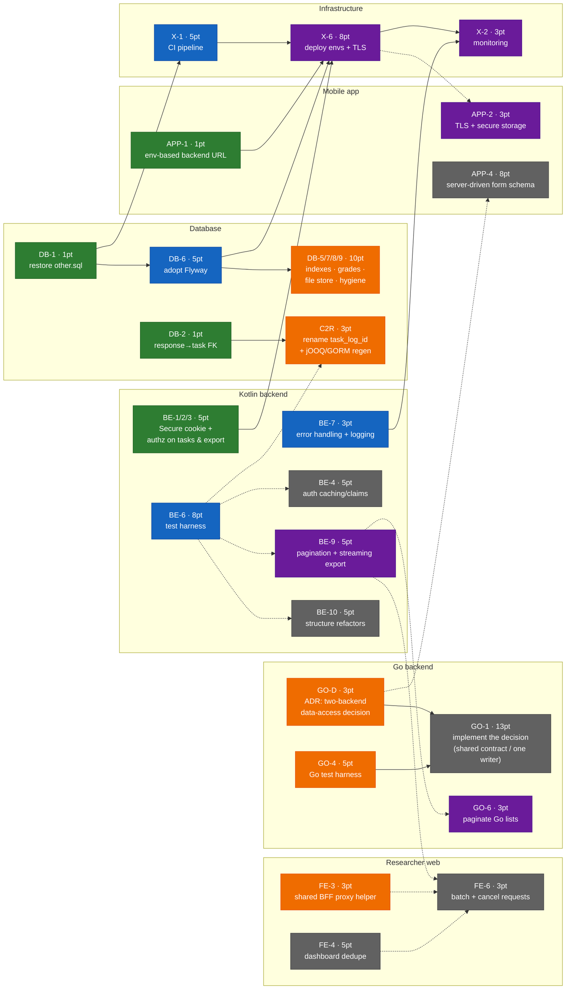

# Fix Dependency Map & Sprint Sizing

Every fix from the [Weak-Point Register](/docs/phase-0), sized in story points (Fibonacci **1 / 3 / 5 / 8 / 13 / 21**) with its dependencies, so the work can be ordered and cut into sprints. Sizes estimate *effort + risk*, not calendar time:

| Points | Feel |
|---|---|
| **1** | One sitting — a few statements or one config change, low risk |
| **3** | A day-ish — one focused change touching a couple of files, needs testing |
| **5** | Several days — cross-cutting change or new capability |
| **8** | A sprint-dominating epic — new infrastructure or a flow rebuilt end-to-end |
| **13+** | Too big to schedule as one item — needs its own design + slicing |

## Dependency diagram

Arrow **A → B** means *A must land before B*. Dotted arrows are soft ("much easier after"). Colors = suggested sprint (legend below). Items with no arrows are listed in the quick-wins table instead — they can be done any time.

**Legend:** 🟩 Sprint 1 · 🟦 Sprint 2 · 🟧 Sprint 3 · 🟪 Sprint 4 · ⬜ Later / Phase II prep

## Quick wins — no dependencies, slot into any sprint

All sized **1 pt** unless noted; ideal for filling spare capacity in Sprint 1:

| ID | Fix | Pts |
|---|---|---|
| [DB-3](/docs/critical-issues#c3) | UNIQUE + NOT NULL on identity columns, `hub_collector` FK | 3 |
| [DB-4](/docs/critical-issues#d2) | Three `geo_id` FKs | 1 |
| BE-8 | Malformed JWT → 401 instead of 500 | 1 |
| FE-2 | Fix 5xx status classification (`in` operator bug) | 1 |
| FE-9 | `BACKEND_URL` fail-fast | 1 |
| FE-7 | Real Terms of Use text | 1 |
| FE-5 | Drop the unused OpenLayers map stack | 1 |
| GO-5 | Health-check endpoint, un-hardcode port | 1 |
| X-4 | Unique bcrypt hashes in seed | 1 |
| M13/R1 | Strip debug `print()`/`console.log` | 1 |

## Suggested sprint plan

Assuming ~20 pts per sprint — adjust to your real velocity after Sprint 1.

| Sprint | Theme | Items | Pts |
|---|---|---|---|
| **1 — Stop the bleeding** | Close security holes, restore rebuildability, all quick wins | DB-1 (1) · DB-2 (1) · BE-1/2/3 (5) · APP-1 (1) + quick-wins table (~12) | ~20 |
| **2 — Foundations** | The enablers everything else leans on | DB-6 Flyway (5) · X-1 CI (5) · BE-6 tests (8) · BE-7 logging (3) | 21 |
| **3 — Refactor under safety net** | Schema batch as migrations, rename, the big decision | DB-5/7/8/9 (10) · C2R (3) · GO-D ADR (3) · GO-4 (5) · FE-3 (3) | ~24 |
| **4 — Deploy & scale readiness** | Phase I's deployment goal | X-6 deploy+TLS (8) · X-2 monitoring (3) · BE-9 pagination (5) · GO-6 (3) · APP-2 (3) | 22 |
| **Later / Phase II prep** | Post-deployment performance + the architectural epic | BE-4 (5) · BE-5 (3) · BE-10 (5) · FE-4 (5) · FE-6 (3) · FE-8 (5) · FE-1 registration (5) · APP-3 (5) · APP-5 (5) · APP-4 (8) · GO-1 (13) | 62 |

Notes on the plan:

- **FE-1 (broken registration, 5 pt)** sits in "Later" only because researchers are currently created by admins ([Admin recipe](/docs/components/database#add-an-admin-user)); pull it forward if self-registration matters for the deployment demo.
- **GO-1 (13 pt)** is deliberately not in a sprint: run the **GO-D ADR spike first** (Sprint 3), then re-slice GO-1 into smaller items once the direction is chosen. A 13 shouldn't enter a sprint whole.
- **APP-4 (8 pt, server-driven forms)** is the main Phase II enabler — schedule it as the bridge between Phase I and Phase II.
- Sprint 4's deploy (X-6) is intentionally *after* tests + CI + Flyway exist: deploying without them recreates the exact process failures Phase 0 found.

## Full item catalog

| ID | Fix | Pts | Hard deps | Register link |
|---|---|---|---|---|
| DB-1 | Restore `other.sql` from `backup.sql` (UTF-16!) | 1 | — | [C1](/docs/critical-issues#c1) |
| DB-2 | FK `form.response → form.task` | 1 | — | [C2](/docs/critical-issues#c2) |
| DB-3 | UNIQUE/NOT NULL identity batch | 3 | — | [C3](/docs/critical-issues#c3) |
| DB-4 | `geo_id` FKs ×3 | 1 | — | [D2](/docs/critical-issues#d2) |
| DB-5 | Hot-path indexes + GiST | 3 | DB-6 | [C4](/docs/critical-issues#more) |
| DB-6 | Adopt Flyway, baseline V1 | 5 | DB-1 | [O1](/docs/critical-issues#o1) |
| DB-7 | Consolidate grades onto `grade_constant` | 3 | DB-6 | [D4](/docs/critical-issues#more) |
| DB-8 | Index + `created_at` on `storage.file` | 1 | DB-6 | [D3](/docs/critical-issues#accepted) |
| DB-9 | Hygiene batch (T1 uuid PK, T3 nullability, T4 CHECKs) | 3 | DB-6 | [T1/T3/T4](/docs/database/fix-decisions#t1) |
| C2R | Rename `task_log_id`→`task_id` + regen jOOQ & GORM models | 3 | DB-2 (soft: BE-6) | [C2](/docs/critical-issues#c2) |
| BE-1/2/3 | Secure cookie + authz on tasks/responses/export | 5 | — | [BE-1…3](/docs/phase-0#2-kotlin-web-backend-researcher-side) |
| BE-4 | Cache/claims-based auth resolution | 5 | soft: BE-6 | BE-4 |
| BE-5 | Fix `fetchRefChoices` schema introspection | 3 | — | BE-5 |
| BE-6 | Backend test harness + first tests | 8 | — | BE-6 |
| BE-7 | Exception handling + structured logging | 3 | — | BE-7 |
| BE-8 | Malformed JWT → 401 | 1 | — | BE-8 |
| BE-9 | Pagination + streaming Excel export | 5 | soft: BE-6 | BE-9 |
| BE-10 | Structure refactors (dedupe services, dead code, layering) | 5 | soft: BE-6 | BE-10 |
| FE-1 | Registration flow end-to-end | 5 | — | [FE-1](/docs/phase-0#3-researcher-web-app-nextjs) |
| FE-2 | 5xx classification bug | 1 | — | FE-2 |
| FE-3 | Shared BFF proxy helper (dedupe 11 routes) | 3 | — | FE-3 |
| FE-4 | Dashboard logic dedupe (3 files) | 5 | — | FE-4 |
| FE-5 | Remove unused map stack | 1 | — | FE-5 |
| FE-6 | Request batching + cancellation | 3 | soft: FE-3, FE-4, BE-9 | FE-6 |
| FE-7 | Real Terms of Use | 1 | — | FE-7 |
| FE-8 | Unit tests + de-flake E2E | 5 | — | FE-8 |
| FE-9 | `BACKEND_URL` fail-fast | 1 | — | FE-9 |
| GO-D | ADR: consolidate two-backend data access? | 3 | — | [GO-1](/docs/phase-0#4-go-mobile-backend) |
| GO-1 | Implement the GO-D decision | 13 | GO-D, GO-4 | GO-1 |
| GO-2 | Roles/authz model in Go JWT | 3 | soft: GO-D | GO-2 |
| GO-4 | Go test harness | 5 | — | GO-4 |
| GO-5 | Health check + config hygiene | 1 | — | GO-5 |
| GO-6 | Paginate Go list endpoints | 3 | soft: BE-9 (same convention) | GO-6 |
| GO-7 | Extract service layer from handlers | 5 | soft: GO-4; folds into GO-1 if consolidating | GO-7 |
| APP-1 | Env-based backend URL | 1 | — | [APP-1](/docs/phase-0#5-flutter-mobile-app) |
| APP-2 | TLS + encrypted local storage | 3 | soft: X-6 (HTTPS endpoint) | APP-2 |
| APP-3 | Flutter test harness | 5 | — | APP-3 |
| APP-4 | Server-driven form schema | 8 | soft: GO-D | APP-4 |
| APP-5 | Sync conflict strategy | 5 | soft: APP-3 | APP-5 |
| X-1 | CI pipeline (build/test/schema-check all repos) | 5 | DB-1 | [X-1](/docs/phase-0#6-cross-cutting--infrastructure) |
| X-2 | Monitoring + log aggregation | 3 | BE-7, X-6 | X-2 |
| X-4 | Unique seed password hashes | 1 | — | X-4 |
| X-6 | Deploy environments + TLS (Phase I goal) | 8 | X-1, DB-6, BE-1/2/3, APP-1 | Phase I |

:::tip[Keep this page honest]
When an item lands, mark it ✅ in the [Weak-Point Register](/docs/phase-0) and strike it here (or move it out of its sprint row). Re-estimate anything that survives two sprint plannings — a size that keeps slipping is usually a 13 in disguise.
:::
