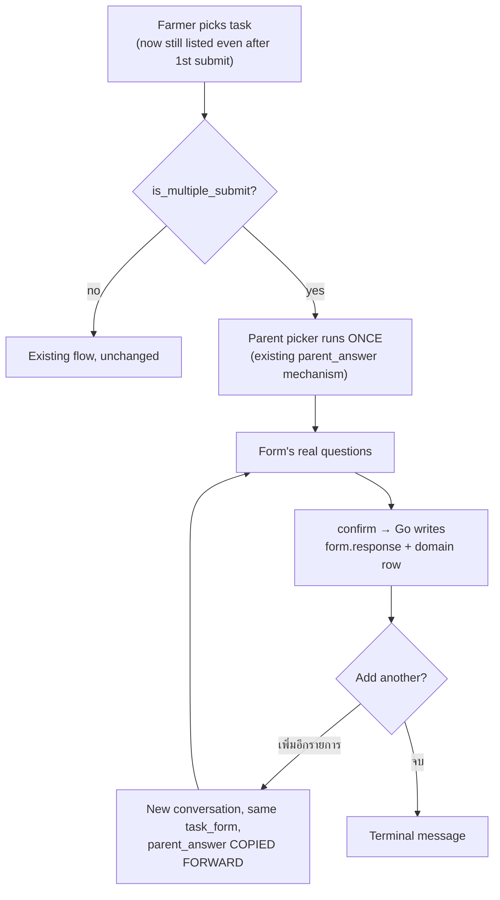

# Designing Multi-Submit Forms

Design doc, not implementation. `form.task_form.is_multiple_submit` has existed since the V1 baseline and **nothing has ever read or written it** — this doc works out what it should mean, what breaks the moment it's true, and how to ship it cheaply first without painting over the structural problem underneath.

Deliberately staged in two phases, because that's how this is being built: **Phase 1 is the cheap way** — smallest change that makes repeat submission work end to end, with shortcuts named honestly. **Phase 2 is the right way** — what the data model actually wants, once there's time.

## What "multi-submit" means here

One form, filled in several times for the same task. Grounded in the handlers that actually exist:

| Handler | Why it needs repeat submission |
|---|---|
| `harvest_grade_detail` | One harvest is graded into several grades — grade A 50kg, grade B 30kg, grade C 20kg. Three rows, one harvest, one sitting. |
| `farm_activity_fertilizer` | Several different fertilizers applied during one farm activity. |
| `farm_activity_chemical` | Same shape — several chemicals, one activity. |
| `fermentation_batch` / `drying_batch` | Repeated readings/stages against one processing batch. |

Note what these five have in common: **they are exactly the five child-row handlers** from [Designing the 5 Blocked Handlers](/docs/plans/chatbot-child-handler-design). That is not a coincidence — a child row is by nature a many-per-parent thing, so "add another one" is the natural next question after that doc's parent picker resolves "which parent?". The two features fit together, and Phase 1 below leans on that deliberately.

The other five handlers (`farm_activity`, `harvest`, `batch`, `processing_record`, `farm_pest_disease_record`) are top-level rows where repeat submission is possible but much less obviously wanted.

### What this is *not*

There is a second, different thing the schema also supports and also doesn't implement: **one task holding several different forms** (`form.task` → many `form.task_form`). That is out of scope here, but worth knowing the current state, because Phase 2 below unlocks it almost for free:

- Every task in the live database has **exactly one** form (max `count(*)` per `task_id` is 1, across all 24 `task_form` rows).
- There is **no API to add a second form to a task** — `POST /forms` creates the task and its single form in one transaction (`FormController.kt:80`), and no `POST /tasks/{taskId}/forms` exists. So multi-form tasks can't even be authored today.
- `FormRepository.findByTaskId` uses jOOQ `fetchOne()` (`FormRepository.kt:32-37`), which throws `TooManyRowsException` with more than one row. It is currently dead code — its only caller `FormService.getFormByTaskId` is itself called from nowhere — so this is latent, not live.

## Current state: what actually breaks

Surveyed across all five repos against `origin/dev` (`origin/test` for mobile-app, `origin/main` for chatbot). The honest summary: **the storage layer is already fine; everything above it infers "done" from "a response exists."**

### The one thing that already works

`form.response` has no unique constraint on `(task_log_id, user_id)` — `response_id` is the PK, and `task_form_id` already exists with an index and an FK to `form.task_form`. **Nothing stops N rows per task per user today.** Repeat submission is not a storage problem.

### The blockers, in order of severity

**1. "Any response exists ⇒ task is done." This is the core blocker, in two places.**

The chatbot picker drops the task entirely (`chatbot/src/line/temp_task_picker.py:66-68`):
```sql
LEFT JOIN form.response r ON r.task_log_id = t.task_id ... WHERE r.response_id IS NULL
```
Once the first grade row is submitted, the whole task disappears from the farmer's Quick Reply list — there is no way to add the second grade.

Go reports the same thing to the mobile app (`mobile-backend/internal/handlers/form_handler.go:161-166`):
```sql
WHEN r.response_id IS NOT NULL THEN 'COMPLETED'
```

**2. `UpdateTaskResponse` mass-updates every response for the task.** (`form_handler.go:509`, predicate at `:525`)
```go
WHERE task_log_id = ? AND user_id = ?
```
With one response this is fine. With three grade rows, editing one edits **all three**. This is a live data-corruption path that opens the moment repeat submission works, and it is the single most important thing to fix before shipping Phase 1.

**3. Responses are never attributed to a form.** `form.response.task_form_id` is `NULL` on **all 80 rows** in the live database — Go's insert map (`form_handler.go:449-457`) simply omits it, even though the column, index, FK, and the Go model field (`internal/models/response.go:16`, `TaskFormID *uuid.UUID`) all already exist. Without this, N responses on one task are indistinguishable by form.

**4. Nothing can learn the flag, even if it were set.** `/service/forms/{formId}` — the service-key endpoint both the chatbot and Go read schemas from — returns `Form.Detail`, and `Form.Detail` **does not carry `isMultipleSubmit`** (`web-backend/src/main/kotlin/com/cocoa/web/model/Form.kt:17-22`). Only `Form.Entity` has it. So the flag is invisible to every consumer.

**5. Researchers can't turn it on.** `Form.Request.Create` (`Form.kt:31-39`) has no `isMultipleSubmit` field; `createForm` never sets it (defaults `FALSE`), `updateForm` never touches it. It is read-only in Kotlin (`FormRepository.kt:49`, `:431`) and surfaced on `Form.Entity` but never written. The web-app carries `isMultipleSubmit: boolean` in its types (`formEditTypes.ts:55`) and never renders it.

**6. The chatbot ends terminally.** `confirm_conversation` (`chatbot/src/conversation/service.py:877`) sets `COMPLETED` and sends a final "บันทึกข้อมูลเรียบร้อยแล้ว" — no "add another?" branch. `git grep is_multiple_submit` across the chatbot returns **zero hits**.

**7. Single-response read paths.** `GetTaskResponse` (`form_handler.go:477`) `Take`s one row per (task, user) — it will only ever return the first of N.

**8. The mobile app's offline queue collides on `task_id`.** Queue lookups are `firstWhere((item) => item['task_id'] == task.taskId)` and removal is `deleteData(event.taskId)` (`mobile-app/lib/bloc/task/task_bloc.dart:31,55,111`). A second queued submission for the same task overwrites the first.

**9. Unordered form lookup.** `submitAnswerForUser` (`form_handler.go:423`) does `.Where("task_id = ?", taskID).First(&taskForm)` with no `ORDER BY`. Harmless while every task has one form; wrong the moment one doesn't.

### The constraint that shapes everything

All five child handlers' parent FKs are **NOT NULL**:

| Child table | Parent FK | Nullable |
|---|---|---|
| `agriculture.farm_activity_fertilizer` | `farm_activity_id` | NO |
| `agriculture.farm_activity_chemical` | `farm_activity_id` | NO |
| `collection.harvest_grade_detail` | `harvest_id` | NO |
| `processing.fermentation_batch` | `batch_id` | NO |
| `processing.drying_batch` | `batch_id` | NO |

So **every** repeat submission must carry its parent ID — the second grade row needs `harvest_id` just as much as the first. The parent picker already solves this once (`chatbot/src/line/parent_picker.py`, stored on `chat.conversation.parent_answer`). Phase 1's loop must **carry that resolved parent forward** rather than re-asking "which harvest?" before every single grade — asking a farmer to re-pick the same harvest three times in a row is the difference between a feature and an annoyance.

## Phase 1 — the cheap way

**Goal:** a farmer can add several rows against one parent in one sitting, a researcher can turn that on, and nothing corrupts. **Non-goal:** anything structural.



### web-backend (Kotlin) — make the flag settable and visible

1. Add `isMultipleSubmit: Boolean = false` to `Form.Request.Create`, and persist it in `FormRepository.createForm`'s `TASK_FORM` insert (`FormRepository.kt:80-105`).
2. Allow toggling it in `updateForm` (or `formEdit`, which already handles toggles).
3. **Add `isMultipleSubmit` to `Form.Detail`** and to `Entity.toDetail` (`Form.kt:17-22`, `:52-59`). This is the load-bearing one — without it neither the chatbot nor Go can see the flag through `/service/forms/{formId}`.

Small by design: the column, the read path, and `Form.Entity` all already exist. This is wiring, not new machinery.

### web-app (Next.js) — one checkbox

A checkbox in `FormCreateModule.tsx` bound to the new request field, and the same in the edit module. The type already carries `isMultipleSubmit` (`formEditTypes.ts:55`); it just needs rendering and sending.

### mobile-backend (Go) — stop lying about "done", stop mass-updating

4. **Populate `task_form_id`** in the `form.response` insert (`form_handler.go:449-457`) — one line, everything else already exists. Do this first; it's what makes the rest addressable.
5. **`GetTasks`**: don't derive `COMPLETED` from response existence when the form is multiple-submit. Cheapest form: join `task_form.is_multiple_submit` and leave those tasks in a non-terminal status.
6. **`UpdateTaskResponse`**: scope to a single `response_id` instead of `(task_log_id, user_id)`. Callers must pass it. **Do not ship Phase 1 without this** — see blocker 2.
7. **`GetTaskResponse`**: return a list rather than `Take`-ing one row (or add a list endpoint and leave the single-row one for the non-multi case).

### chatbot (Python) — keep the task visible, and loop

8. **Picker**: don't exclude a task whose form is multiple-submit (`temp_task_picker.py:66-68`). Cheapest form: `AND NOT tf.is_multiple_submit` alongside the existing `r.response_id IS NULL` condition.
9. **Loop at confirm**: in `confirm_conversation`, when the form is multiple-submit, replace the terminal message with two Quick Reply buttons — "➕ เพิ่มอีกรายการ" / "✅ จบ". On "เพิ่มอีกรายการ", start a fresh conversation on the **same `task_form_id`**, copying `parent_answer` forward so the parent picker does not run again.

### mobile-app (Flutter) — don't let queued submissions collide

10. Key the offline queue by a per-submission id (a client-generated UUID) rather than `task_id`, and match/remove on that instead (`task_bloc.dart:31,55,111`).

### What Phase 1 deliberately does *not* fix

Name these in the PR so nobody mistakes them for oversights:

- **"Done" is still inferred, never declared.** A multi-submit task now simply never auto-completes, so it sits in the farmer's picker indefinitely until `close_at` passes. There is no "I'm finished adding grades" state. This is the honest cost of the cheap route.
- **No submission-session concept.** Three grade rows entered in one sitting are three unrelated rows. You cannot review them as a set, and you cannot undo the batch.
- **`form.assignment` stays unused** (see Phase 2).
- **Retry-vs-genuine-duplicate is now ambiguous.** Previously, a duplicate row from a timeout retry was detectable in principle — the same farmer submitting the same task twice was obviously wrong. Once repeat submission is legitimate, it is not. [The child-handler doc](/docs/plans/chatbot-child-handler-design) records exactly this incident on 2026-08-19: Go succeeded, took 6.6s, the chatbot's 5s httpx timeout reported failure and told the farmer to retry, and `dissectAnswer` has no idempotency guard. The timeout was raised to 30s, but **the missing idempotency guard is now a materially bigger risk** and should be revisited during Phase 1 even though it isn't strictly part of it.

## Phase 2 — the right way

What the model actually wants, once the cheap version has been in real farmers' hands long enough to learn from.

**1. Make `form.assignment` real.** The table exists (`assignment_id`, `task_id`, `user_id`, `status`, `started_at`, `completed_at`), is **completely unpopulated**, and is **never referenced anywhere in the Go repo** (`git grep -i assignment origin/dev` returns only a linter name). The chatbot's own code comments note it "turns out to be unpopulated in this DB" (`temp_task_picker.py:38-42`). This is the designed-but-never-built home for task lifecycle. With it, "done" becomes an explicit state a farmer sets ("✅ จบ" writes `completed_at`) rather than a count of rows — which is precisely what Phase 1 can't do.

**2. Address submissions by identity, everywhere.** Every read, update, and delete path keys off `response_id`; `task_form_id` is always populated; nothing anywhere matches on `(task_log_id, user_id)` and hopes for one row. This also retires blockers 2, 7, and 9 permanently rather than patching them.

**3. A submission session (batch) for repeat-submit.** N rows entered under one parent selection in one sitting, grouped so they can be reviewed, amended, and rolled back as a unit. This is what makes "I entered five grades and grade B was wrong" a fixable situation instead of a support ticket. It's also the natural place to hang idempotency keys, which retires the duplicate-retry ambiguity above.

**4. Per-form addressing unlocks multi-form tasks for free.** Once everything speaks `task_form_id` rather than `task_id`, the *other* meaning of "multi form" — one task with several different forms — becomes mostly an authoring problem (`POST /tasks/{taskId}/forms` plus builder UI) rather than a rework of every consumer. Worth keeping in view while doing Phase 2 so the abstractions don't foreclose it.

## Open decisions

Worth answering before or during Phase 1, none of them blocking the survey work:

1. **When does a multi-submit task end?** Phase 1's answer is "at `close_at`, or never." If farmers find a permanently-listed task confusing, the "✅ จบ" button needs somewhere to write — which is Phase 2's `form.assignment`, pulled forward.
2. **Is there a cap?** Should a form be allowed 50 submissions? LINE's Quick Reply cap is 13 and the picker is already close to it; unbounded row creation from a chat interface deserves at least a sanity limit.
3. **Should the parent picker re-run per submission?** Phase 1 says no (carry it forward). But a farmer grading harvests from two different lots in one sitting would want to switch parents without exiting. Possibly a third button: "➕ เพิ่ม (เปลี่ยนแปลง/ชุดอื่น)".
4. **Autofill interaction.** `GetLastAnswer` (`form_handler.go:343`) prefills from the previous answer and joins one form per task (`:366`). For repeat submission, prefilling the previous grade row is genuinely useful — but "last answer" needs to mean last answer *for this form*, which depends on fix 4 above landing first.
5. **Does Go re-verify the parent ID?** [Already flagged as open](/docs/plans/chatbot-child-handler-design) for the single-submission case; repeat submission multiplies the blast radius of a bad or spoofed parent ID.

## Sequencing

Phase 1, in dependency order — 4 and the web-backend `Form.Detail` change gate almost everything else:

1. **web-backend**: `isMultipleSubmit` on `Form.Request.Create`, persisted in `createForm`, toggleable in update, **and added to `Form.Detail`**. Nothing downstream can start until the flag is settable and visible.
2. **Go fix 4**: populate `response.task_form_id`. One line; makes everything else addressable.
3. **Go fix 6**: `UpdateTaskResponse` scoped by `response_id`. Ship this *before* anything can create a second response — it is a corruption path, not a feature gap.
4. **Go fixes 5, 7**: `GetTasks` status, `GetTaskResponse` list.
5. **chatbot fixes 8, 9**: picker visibility, then the confirm loop with `parent_answer` carried forward.
6. **web-app**: the builder checkbox. Can run in parallel with 2–5; only needs step 1.
7. **mobile-app fix 10**: queue key. Independent of everything else; only needed before the app (rather than LINE) is used for multi-submit.
8. **Revisit `dissectAnswer` idempotency** — not strictly Phase 1, but the risk it covers gets worse the moment this ships.

## Related

- [Designing the 5 Blocked Handlers for the Chatbot](/docs/plans/chatbot-child-handler-design) — the parent picker this builds directly on, the `parent_answer` mechanism Phase 1 carries forward, and the 2026-08-19 timeout/idempotency incident referenced above
- [Designing SubmitTask's Dissection Logic](/docs/plans/task-dissection-design) — the generic `dissectAnswer` write path every repeat submission goes through
- [Weak-Point Register](/docs/phase-0) — where the register's per-repo items were tracked
