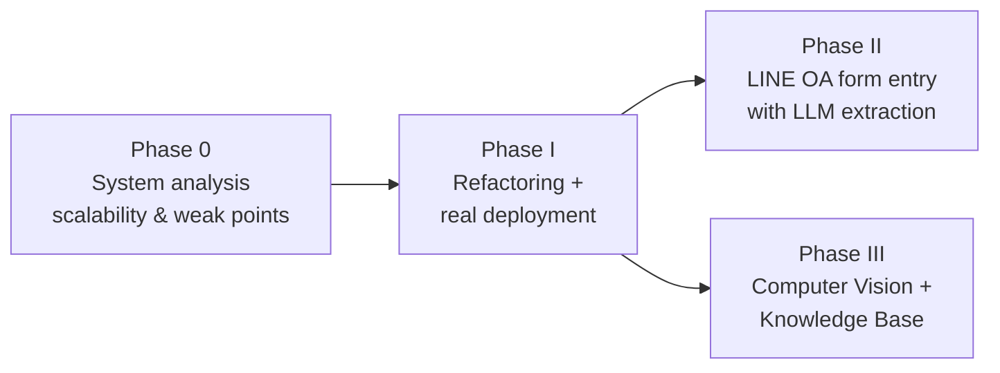

# Roadmap

The capstone continues the **ระบบฐานข้อมูลจัดเก็บสำหรับห่วงโซ่อุปทานของโกโก้** (Databank for Cocoa Supply Chain) in three official phases, preceded by the analysis phase we are in now. A core constraint runs through all of it: **the existing layers must be able to handle and work with what each phase adds** — that is exactly what [Phase 0](/docs/phase-0) assesses.

## Phase 0 — System analysis (current)

Analyze the inherited system: can it scale, and can it support Phases II–III? Deliverable: the **[Weak-Point Register](/docs/phase-0)** — every weakness across database, both backends, both clients, and infrastructure, each with a fix / accept / undecided decision.

**Inputs:** [Database Review](/docs/database/db-review) · [Researcher-Side Code Audit](/docs/phase-0/researcher-audit) (47 findings) · [Flutter Analysis](/docs/phase-0/flutter-analysis) · [Go Server Walkthrough](/docs/phase-0/go-server-walkthrough)

**Exit criterion:** every 🔴 item in the register has a decision, and the Phase I work list below is confirmed.

## Phase I — การปรับปรุงโครงสร้างระบบเดิมและนำระบบขึ้นใช้งานจริง (System Refactoring & Deployment)

Refactor the existing system and database for efficiency, stability, and maintainability, and deploy it for real users — a stable foundation for the later technology phases.

Work list (driven by the register's 🔧 items):

1. **Database integrity batch** — restore `other.sql`, response→task FK, UNIQUE constraints, geo FKs, hot-path + GiST indexes ([DB-1…DB-5](/docs/phase-0#1-database)); adopt **Flyway** ([DB-6](/docs/critical-issues#o1)).
2. **Security before exposure** — `Secure` cookie flag, authorization on task responses and raw-data export, JWT error handling, TLS everywhere, mobile config/secure storage ([BE-1…BE-3, BE-8, APP-1, APP-2](/docs/phase-0)).
3. **Broken-feature repairs** — web registration flow end-to-end ([FE-1](/docs/phase-0#3-researcher-web-app-nextjs)), 5xx classification ([FE-2](/docs/phase-0#3-researcher-web-app-nextjs)), real Terms of Use (FE-7).
4. **Refactoring targets** — deduplicate analytics services and BFF routes, remove dead code, fix layering violations (BE-10, FE-3, FE-4); decide the **two-backend data-access question** ([GO-1/X-3](/docs/phase-0#4-go-mobile-backend)) before Phase II adds another writer.
5. **Deployment & operations** — CI pipeline (build + test + schema-apply check), environments, monitoring/structured logging, health checks ([X-1, X-2](/docs/phase-0#6-cross-cutting--infrastructure)); tests as the refactoring safety net (BE-6, FE-8, GO-4, APP-3).

**Expected outcome (from the proposal):** the legacy system has a standardized, **scalable** structure and is deployed for real supply-chain data.

## Phase II — ระบบกรอกข้อมูลผ่าน LINE OA ด้วย LLM

Add a LINE Official Account channel so farmers can submit farm data conversationally, with an **LLM extracting and structuring the answers** into the databank — improving data continuity and reducing input errors.

What it needs from the base (why Phase I comes first):

- A single, validated form-submission API with a real `response → task` FK (DB-2) — the LLM output must land in the same `form` schema the mobile app uses.
- A server-owned form schema (finish [APP-4](/docs/phase-0#5-flutter-mobile-app)'s server-driven forms) so LINE OA, mobile, and web render the same source of truth.
- A resolved ingestion architecture (GO-1/X-3): LINE OA should not become a *third* independent implementation of submission logic.

## Phase III — Computer Vision + Knowledge Base

Integrate CV for agricultural use — e.g. **detecting and diagnosing cocoa tree diseases** — and build a Knowledge Base consolidating domain knowledge for deep analysis.

This phase is built on **entirely new data** (disease imagery, curated knowledge) that starts arriving in Phase III itself — its storage, processing, and modeling get designed then, not judged against today's system ([Phase 0 verdict](/docs/phase-0#verdict-is-the-base-scalable-for-what-actually-reuses-it) deliberately leaves it out of scope). Known touchpoints with the existing base, all small and already tracked:

- `storage.file` hygiene ([DB-8](/docs/phase-0#1-database)) would make the generic file store a comfortable landing zone for images if Phase III chooses to reuse it.
- A single grade/defect vocabulary ([DB-7](/docs/phase-0#1-database)) would give training labels one source of truth — the existing `dataset/` (grading image classes B, C) is an early asset.
- A healthy, deployed Phase I base (CI, observability, access control) is the platform Phase III ships onto.

## Working agreements

- **Schema changes** follow the checklist on the [Database page](/docs/components/database#making-schema-changes-current-manual-process) until Flyway lands — then they're Flyway migrations.
- **Decisions get logged** — register decisions and anything a future teammate would ask "why?" about goes in the [Project Log](/log).
- **This site is the source of truth** for project knowledge; the transfer folder is the archive.
