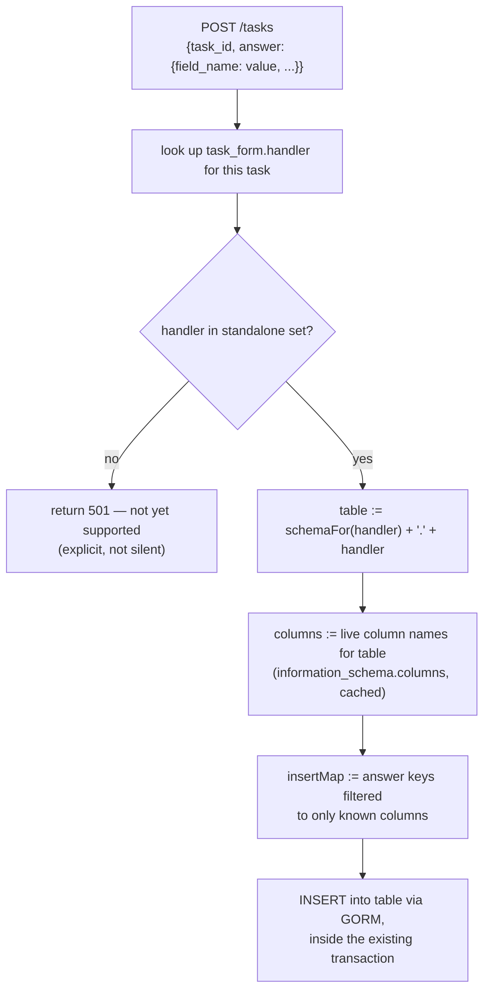

# Designing SubmitTask's Dissection Logic

Design doc, not implementation — for whoever picks up the Go dissection fix already flagged in the [backend fix proposal](/docs/plans/backend-fix-proposal). Everything below is verified against the live database and the actual Go source, not assumed.

## Current state — there is no logic, static or dynamic

`internal/handlers/form_handler.go:99-106`, inside `SubmitTask`'s transaction:

```go
switch taskForm.Handler {
case "harvest":
    fmt.Println("ประมวลผล: harvest")
// ... case อื่นๆ ...
default:
    fmt.Printf("บันทึกทั่วไปสำหรับ handler: %s\n", taskForm.Handler)
}
```

This prints a debug line. No `INSERT` exists anywhere in the Go codebase for any handler. This is not "hardcoded but working" — it's a stub. Whoever builds this is starting from nothing, which means the static-vs-dynamic choice is genuinely open, not something to retrofit.

## Why dynamic is viable here, not just theoretically nicer

`form.question.field_name` already names the exact destination column for a handler's table — verified, it's the same mechanism `fetchRefChoices` (Kotlin) already relies on for dropdown resolution. And `handler` already matches a real table name once you add the schema prefix — confirmed against all 10 live handler values (table below). So instead of hand-writing 10 near-identical Go functions, the destination columns for an `answer` map can be derived from the same metadata that already exists.

**This does not depend on the read side becoming dynamic, or on Kotlin at all.** Go already holds its own connection to the shared database — it can validate `field_name`s against live column names via `information_schema.columns` directly, with zero dependency on the still-open Go→Kotlin auth question from [ADR 0001](/docs/adr/old-new-integration-seam). The read-dynamism proposal and this one are independent; this one is unblocked today.

## All 10 handlers, classified

Verified against the live schema — this is a clean split, not a guess:

| Handler | Table | Standalone? |
|---|---|---|
| `farm_activity` | `agriculture.farm_activity` | ✅ own generated PK, all FKs (`farm_id`, `plot_id`, `farm_activity_type_id`) are pick-an-existing-one references |
| `processing_record` | `processing.processing_record` | ✅ own generated PK, `batch_id`/`weather_condition_id`/etc. are all pick-existing references |
| `farm_pest_disease_record` | `agriculture.farm_pest_disease_record` | ✅ own generated PK, same pattern |
| `harvest` | `collection.harvest` | ✅ own generated PK |
| `batch` | `processing.batch` | ✅ own generated PK |
| `farm_activity_fertilizer` | `agriculture.farm_activity_fertilizer` | ❌ composite PK `(farm_activity_id, fertilizer_id)` — no independent identity |
| `farm_activity_chemical` | `agriculture.farm_activity_chemical` | ❌ composite PK `(farm_activity_id, chem_bio_id)` |
| `harvest_grade_detail` | `collection.harvest_grade_detail` | ❌ composite PK `(harvest_id, grade_code)` |
| `fermentation_batch` | `processing.fermentation_batch` | ❌ PK **is** `batch_id` itself — a 1:1 detail row on an existing batch, not its own entity |
| `drying_batch` | `processing.drying_batch` | ❌ same — PK is `batch_id` |

Five handlers have their own generated identity and can be dissected generically today. Five are detail/child rows that require a parent ID **from outside the submission's own answer payload** — that's a product question, not a code question, and it's genuinely unresolved (see below).

## Design: the generic path (5 standalone handlers)



Sketch, matching the existing handler's style (not tested — this is a design, not a PR):

```go
var handlerTables = map[string]string{
	"farm_activity":            "agriculture.farm_activity",
	"processing_record":        "processing.processing_record",
	"farm_pest_disease_record": "agriculture.farm_pest_disease_record",
	"harvest":                  "collection.harvest",
	"batch":                    "processing.batch",
}

func dissect(tx *gorm.DB, handler string, answer map[string]interface{}) error {
	table, ok := handlerTables[handler]
	if !ok {
		return fmt.Errorf("handler %q not yet supported for dissection", handler)
	}

	columns, err := liveColumns(tx, table) // information_schema.columns, cached per table
	if err != nil {
		return err
	}

	insertMap := map[string]interface{}{}
	for field, value := range answer {
		if columns[field] {
			insertMap[field] = value
		}
	}

	return tx.Table(table).Create(insertMap).Error
}
```

`liveColumns` is the part worth being deliberate about — it's the allowlist that makes this safe:

```go
func liveColumns(tx *gorm.DB, table string) (map[string]bool, error) {
	parts := strings.SplitN(table, ".", 2)
	var names []string
	err := tx.Raw(
		`SELECT column_name FROM information_schema.columns WHERE table_schema = ? AND table_name = ?`,
		parts[0], parts[1],
	).Scan(&names).Error
	if err != nil {
		return nil, err
	}
	set := make(map[string]bool, len(names))
	for _, n := range names {
		set[n] = true
	}
	return set, nil
}
```

Cache this per table (in-process, invalidated on deploy) rather than querying `information_schema` on every submission — it only changes when a Flyway migration runs.

**Why the allowlist matters, concretely:** without it, `answer`'s keys go straight into a dynamic `INSERT` built from farmer-controlled JSON. Filtering against real column names first is what turns "arbitrary write target" into "write target constrained to this table's actual schema" — this is the whole safety argument for the dynamic approach, not an optional hardening step.

## The 5 blocked handlers — a product question, not a code one

`farm_activity_fertilizer`, `farm_activity_chemical`, `harvest_grade_detail`, `fermentation_batch`, `drying_batch` all need a parent ID (`farm_activity_id`, `harvest_id`, `batch_id`) that isn't in their own answer payload. Each is its own separate `task_form`/`handler` with its own task count roughly matching its parent's (e.g. `batch`: 4 tasks, `fermentation_batch`: 4, `drying_batch`: 3) — so this isn't a data-entry accident, it's a real, repeated pattern across the domain.

Two live options, not decided:

1. **Chained submission** — one UI flow submits the parent (e.g. `batch`) and its detail rows (e.g. `fermentation_batch`) together, sharing a parent ID generated in the same transaction. Requires the mobile/chatbot client to know these are linked, not just "one form, one submission."
2. **Reference by selection** — the detail form has its own `OPTION` question ("which batch is this for?"), resolved the same way `province_id` already is, pointing at an existing parent row created earlier. No client-side chaining needed, but requires the parent to already exist before the detail form is usable.

This needs an answer from whoever owns the farmer-facing UX for these flows (both mobile and, eventually, the chatbot's own guided flow) before any of these 5 handlers can be dissected — building dissection logic without that answer means guessing at a data model nobody's confirmed.

## What to actually do, in order

1. Ship the generic path for the 5 standalone handlers now — real value, zero external blockers.
2. Return an explicit, honest error for the other 5 (`501` or similar) rather than the current silent no-op — this alone is an improvement even before they're designed further.
3. Get the chained-submission-vs-reference-by-selection decision from whoever owns the farmer UX.
4. Extend `handlerTables` (or a generalized "parent lookup" step) once that's decided — the generic engine itself doesn't need to change, just what feeds it.

## Related

- [Backend Fixes Needed for the Chatbot Project](/docs/plans/backend-fix-proposal) — where this was first flagged as a chatbot blocker
- [Making the Form Maker Actually Dynamic](/docs/plans/dynamic-form-proposal) — the read-side counterpart; independent of this design, not a prerequisite for it
- [ADR 0001 — Old↔New Integration Seam](/docs/adr/old-new-integration-seam) — why the chatbot depends on this working for real before it can submit anything
